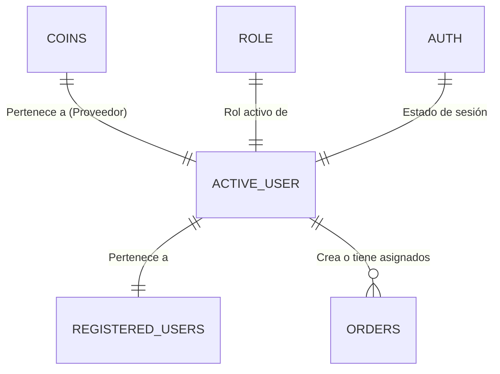
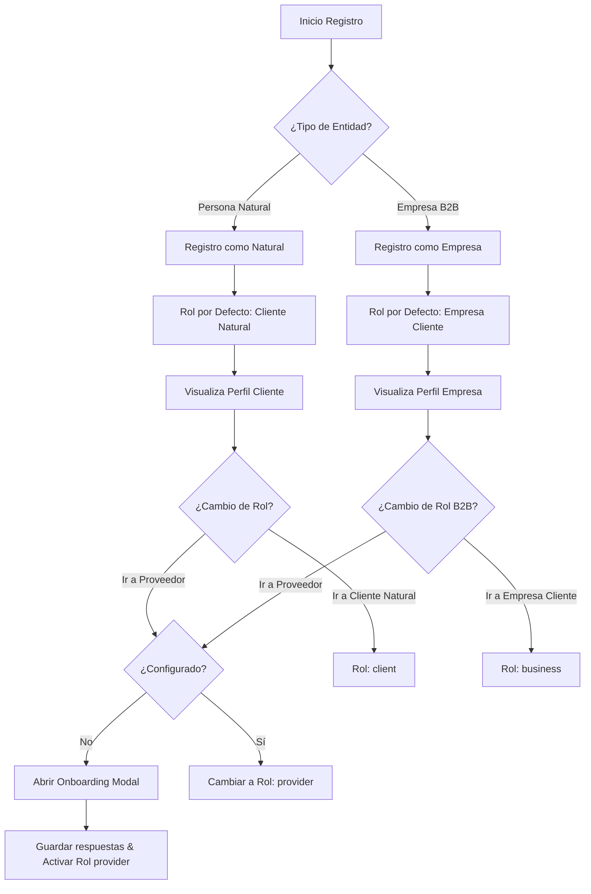
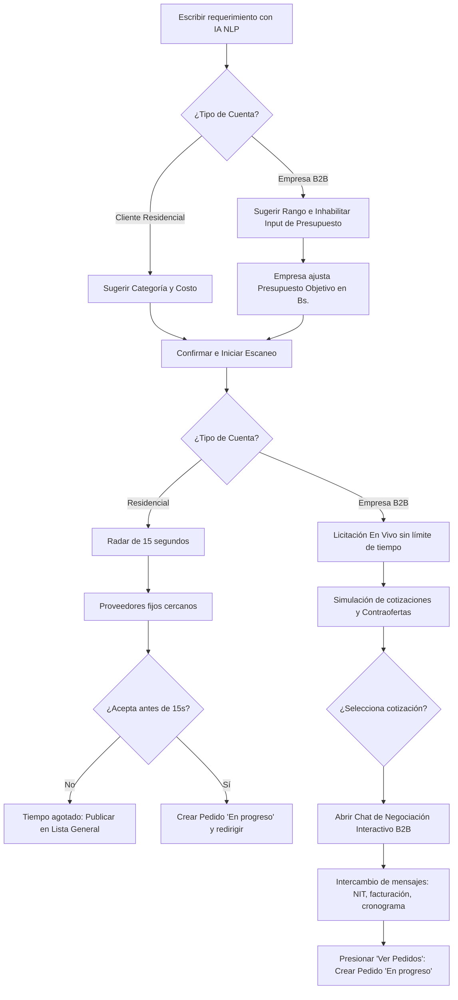
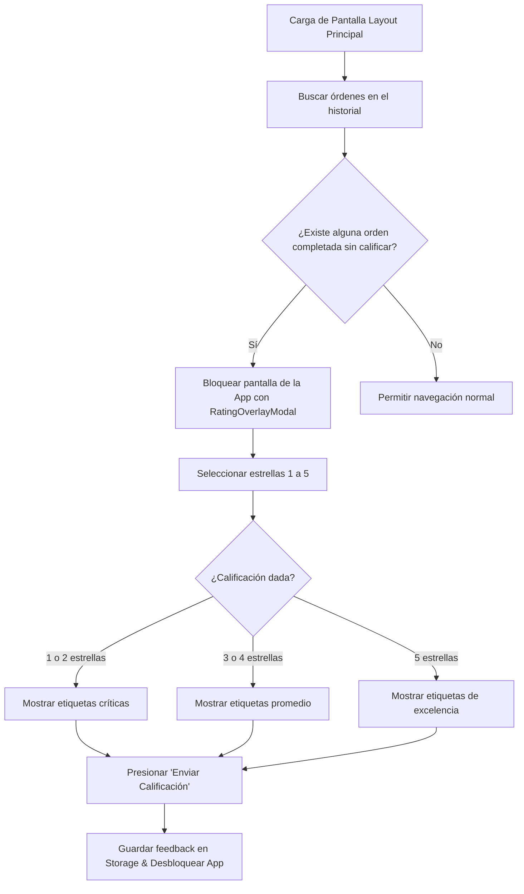

# Diseño Lógico, Conceptual y Gráfico — Todo Ya 📐🎨

Este documento detalla el diseño conceptual, los diagramas de flujo de procesos, los casos de uso del sistema, la lógica visual de las interfaces de usuario y todo el sistema gráfico de **Todo Ya**. Servirá de guía arquitectónica de referencia y se actualizará a medida que incorporemos nuevas funcionalidades.

---

## 💾 1. Modelo Conceptual y de Datos (Storage)

La aplicación utiliza persistencia de datos local clave-valor administrada por [storage.ts](file:///c:/Users/PCZ/Desktop/todo-ya/src/utils/storage.ts) que simula una base de datos distribuida mediante llaves.

### Estructura de Claves del Storage y Relaciones Conceptuales


* **`todo_ya_active_user`**: Almacena el objeto serializado del usuario en sesión (`UsuarioRegistrado`).
* **`todo_ya_registered_users`**: Array JSON con todos los usuarios registrados (nuestra base de datos de usuarios local).
* **`todo_ya_orders`**: Array JSON con el historial de pedidos, solicitudes y licitaciones creadas en la app.
* **`todo_ya_role`**: Cadena con el rol activo en tiempo de ejecución (`'client' | 'provider' | 'business'`).
* **`todo_ya_coins`**: Entero con el saldo de monedas del proveedor (necesarias para postularse a servicios).
* **`todo_ya_auth`**: Booleano (`'true' | 'false'`) que determina si hay una sesión activa.

---

## 🔄 2. Diagramas de Flujo de Procesos (Workflows)

### A. Registro, Selección y Separación de Roles (Natural vs. Empresa)
Este diagrama describe cómo un usuario se registra y cómo la interfaz se bloquea/adapta según sea una cuenta de Persona Natural o Empresa (B2B).



### B. Ciclo de Vida de Solicitudes y Subastas en Tiempo Real (Residencial vs. B2B)
Este flujo visualiza la diferencia entre pedir un servicio residencial (con un radar de 15 segundos) y una licitación corporativa B2B (con presupuesto objetivo propio y contraofertas con chat interactivo).



### C. Bloqueo de Calificación Forzada (Rating Overlay)
Este diagrama ilustra la lógica aplicada en el Layout Principal para obligar a calificar el último servicio completado antes de permitir cualquier navegación.



---

## 👥 3. Casos de Uso del Sistema

| Actor | Caso de Uso | Descripción |
| :--- | :--- | :--- |
| **Cliente Natural** | Crear Pedido Domiciliario | Describe una necesidad, valida la categoría sugerida por IA, escanea por 15 segundos, acepta la oferta y espera al técnico. |
| **Empresa (Cliente B2B)** | Licitación Corporativa | Define sus requerimientos y presupuesto. Recibe contraofertas de proveedores de insumos/servicios. Negocia facturación, NIT y términos vía chat interactivo antes de proceder. |
| **Proveedor Residencial** | Postularse a Leads de Bolsa | Utiliza sus monedas para aceptar trabajos publicados en la bolsa general de servicios residenciales cercanos que no fueron asignados durante los 15 segundos del radar. |
| **Proveedor B2B** | Enviar Contraofertas | Envía cotizaciones personalizadas (contraofertas) a licitaciones corporativas y conversa con el cliente corporativo para coordinar la logística. |

---

## 📱 4. Lógica de Interfaz de Usuario y Transición de Vistas

### Esquema de Flujo de Pantallas B2B
```
[Pantalla Nueva Solicitud B2B] 
      │ 
      ▼ (Analizar con IA)
[Detalle del Presupuesto Objetivo (Modificable)]
      │
      ▼ (Confirmar y Buscar)
[Pantalla de Subasta - Cotizaciones En Vivo] 
      │
      ▼ (Aceptar y Chatear)
[Pantalla de Chat Interactivo (Negociación)]
      │
      ▼ (Ver Pedidos)
[Historial de Pedidos Activos (En Progreso)]
```

---

## 🎨 5. Sistema de Diseño Visual y Gráfico

Este apartado establece la guía visual, el branding, los colores, la tipografía y los estilos aplicados al proyecto para asegurar consistencia estética de alta gama (Premium).

### A. Paleta de Colores Adaptativa (Branding)
La aplicación utiliza dos esquemas cromáticos dependiendo del contexto del usuario, logrando una diferenciación clara entre el servicio comercial común y el segmento corporativo premium:

*   **Identidad Natural / Residencial (Amarillo Todo Ya):**
    *   **Color Primario:** `#FFB400` (Amarillo vibrante, confiable y dinámico, inspirado en el icono de la aplicación).
    *   **Uso:** Botones de acción principal, iconos activos de barra inferior, barras de progreso de pedidos residenciales.
*   **Identidad B2B / Empresa (Índigo Corporativo):**
    *   **Color Primario:** `#6366f1` / `#818cf8` (Morado/Índigo profesional y tecnológico).
    *   **Uso:** Botones de acción en perfiles de empresa, cotizaciones de subastas corporativas, chats corporativos, barras de progreso B2B.
*   **Colores de Estado y Alertas:**
    *   **Completado (Éxito):** `#4caf50` (Verde).
    *   **Pendiente / Buscando:** `#ef5350` / `#FFB400` (Rojo o Amarillo).
    *   **Fondo de Alertas:** `#ffebee` (Rojo claro) o `#e8f5e9` (Verde claro).
*   **Colores de Interfaz Premium (Dark & Light Mode Sleek):**
    *   **Fondo Principal Oscuro (Contenedores):** `#1e1e1e` / `#2f2f2f` (Gris oscuro elegante).
    *   **Fondo de Tarjetas (Cards):** `#2F2F2F` con bordes finos `#3d3d3d`.
    *   **Textos:** `#ffffff` (Títulos), `#aaaaaa` (Secundarios), `#2f2f2f` (Textos sobre fondos claros/amarillos).

### B. Jerarquía Tipográfica y Estilos
Se definen reglas de tipografía basadas en las fuentes del sistema (San Francisco en iOS, Roboto en Android) pero ajustadas mediante pesos y tamaños jerárquicos:

*   **Títulos de Sección (`Title`):** `fontSize: 24`, `fontWeight: 'bold'`, `color: '#ffffff'` o `#FFB400`.
*   **Subtítulos (`Subtitle`):** `fontSize: 18`, `fontWeight: '600'`, `color: '#ffffff'`.
*   **Cuerpo de Texto (`Body`):** `fontSize: 14`, `fontWeight: 'normal'`, `color: '#aaaaaa'`.
*   **Etiquetas y Botones (`Label/Button`):** `fontSize: 15`, `fontWeight: 'bold'`, `textTransform: 'uppercase'`.

### C. Activos y Recursos Gráficos
Los recursos multimedia e iconos clave del proyecto están ubicados en la carpeta `/assets/images/`:

*   **Icono de la App:** [icon.png](file:///c:/Users/PCZ/Desktop/todo-ya/assets/icon.png) (Icono circular en amarillo `#FFB400` con el logo de un rayo/cronómetro).
*   **Splash Screen (Pantalla de carga inicial):** [splash.png](file:///c:/Users/PCZ/Desktop/todo-ya/assets/splash.png) (Diseño con fondo oscuro premium y el logo centrado con resplandor).
*   **Icono Adaptativo Android:** [android-icon-foreground.png](file:///c:/Users/PCZ/Desktop/todo-ya/assets/images/android-icon-foreground.png).
*   **Fondo con Resplandor del Logo:** [logo-glow.png](file:///c:/Users/PCZ/Desktop/todo-ya/assets/images/logo-glow.png).
*   **Iconos de Tabs:** `/assets/images/tabIcons/home.png` y `/assets/images/tabIcons/explore.png` (usados para la barra inferior de navegación).

### D. Elementos UI Clave (Wireframes Conceptuales)

A continuación se muestra el esquema visual de los componentes de UI más importantes de la app.

#### 1. Tarjeta de Cotización / Licitación B2B
```
┌────────────────────────────────────────────────────────┐
│  🛠️  PROVEEDOR: Juan Pérez (Pro)        ⭐ 4.9          │
├────────────────────────────────────────────────────────┤
│  Descripción: Insumos de plomería industriales.        │
│  "Puedo proveer la tubería de cobre con facturación"   │
├────────────────────────────────────────────────────────┤
│  Presupuesto Cliente: 800 Bs.                           │
│  Contraoferta Proveedor: 850 Bs. [Diferencia: +50 Bs.] │
├────────────────────────────────────────────────────────┤
│  [ RECHAZAR ]                       [ ACEPTAR Y CHATEAR ]│
└────────────────────────────────────────────────────────┘
```

#### 2. Radar de Búsqueda de Proveedores (Residencial)
```
┌────────────────────────────────────────────────────────┐
│               Buscando proveedores...                  │
│                     ( 12 s )                           │
│                                                        │
│                     / \  * Proveedor A                 │
│                    /   \                               │
│                   (  ◎  )     * Proveedor B            │
│                    \   /                               │
│                     \ /                                │
│                                                        │
│        Escaneando el área en busca de técnicos...      │
└────────────────────────────────────────────────────────┘
```

#### 3. Ventana de Chat de Negociación B2B
```
┌────────────────────────────────────────────────────────┐
│  🗣️  Chat de Negociación - Distribuidora Norte          │
├────────────────────────────────────────────────────────┤
│  [Juan Pérez]: Buenas tardes, cuento con stock de los │
│  materiales. ¿Requiere factura con algún NIT especial? │
│                                                        │
│  [Tú (Empresa)]: Sí, por favor. NIT 4829102 y Razón    │
│  Social: Constructoras Unidas S.R.L.                    │
│                                                        │
│  [Juan Pérez]: Perfecto, ya emití la cotización final.│
│  Presione 'Ver Pedidos' para ver el progreso de la     │
│  orden y su entrega.                                   │
├────────────────────────────────────────────────────────┤
│  [ Escribe un mensaje aquí...                 ] [Send] │
└────────────────────────────────────────────────────────┘
```

---

## 🚀 6. Próximas Implementaciones Gráficas y Lógicas

*   **Pantalla de Monedas Expandida:** Panel visual premium para la compra de monedas de proveedores con animaciones de cofres/monedas doradas 3D (empleando `lottie` o micro-animaciones).
*   **Historial de Facturación B2B:** Un componente de descarga directa de PDFs de facturación simulados para las empresas.
*   **Filtros de Categorías Avanzados:** Carrusel con iconos vectoriales animados para las distintas categorías del hogar e industria.
