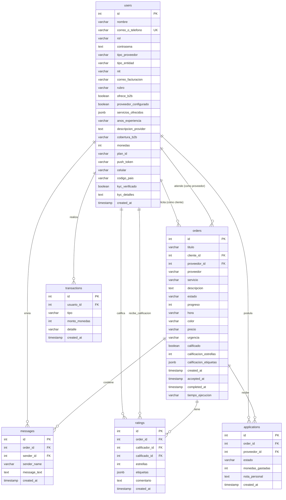
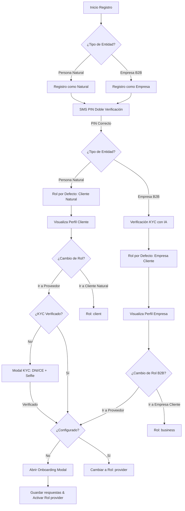
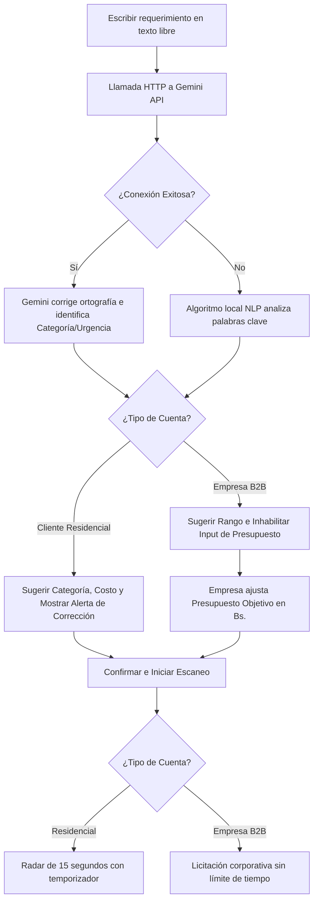
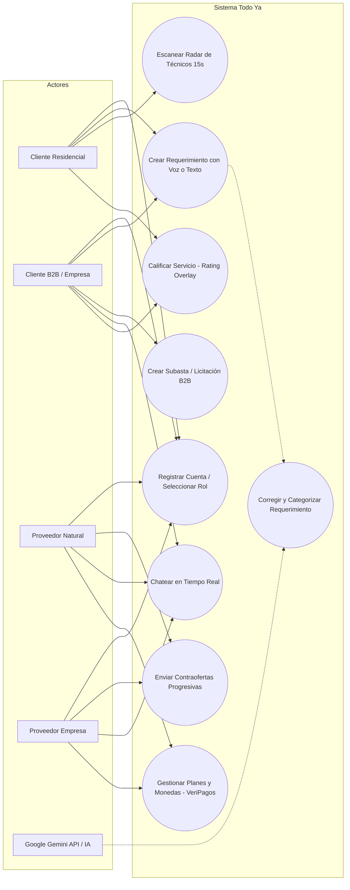

# Ficha Técnica y Manual de Implementación — Todo Ya 📋🛠️

Este documento unificado contiene las especificaciones técnicas completas, la arquitectura de software, los modelos de datos, los diagramas de flujo conceptuales, el sistema gráfico y la guía de implementación del proyecto **Todo Ya**.

---

## 📌 1. Información General

* **Nombre del Proyecto**: Todo Ya
* **Tipo de Aplicación**: Aplicación móvil universal multiplataforma (Android & iOS) y Web (PWA).
* **Framework Principal**: Expo SDK 56 & React Native 0.85.
* **Idioma de Desarrollo**: Español (código fuente, comentarios e interfaz).
* **Control de Tipos**: TypeScript 6.0.

---

## 📁 2. Estructura del Proyecto y Archivos

El árbol de directorios del código fuente está estructurado de la siguiente manera:

```text
Todo_ya-/
├── metro.config.js                  # Configuración de resolución ESM para Metro/Expo
├── app.json                         # Configuración de Expo y API Routes (output: server)
├── package.json                     # Dependencias y scripts npm
├── assets/                          # Activos del proyecto (iconos, splash, imágenes)
└── src/
    ├── db/                          # Capa de Persistencia y Modelado ORM
    │   ├── index.ts                 # Instanciación de Drizzle con Neon.db (HTTP Serverless)
    │   └── schema.ts                # Modelado relacional (users, orders) en TypeScript
    ├── i18n/                        # Configuración de Internacionalización (i18n)
    │   ├── index.ts                 # Configuración de i18next y expo-localization
    │   └── locales/                 # Diccionarios JSON de traducción (es, en, qu, ay, gn)
    ├── components/                  # Componentes reutilizables (ej: map-view)
    ├── constants/                   # Valores constantes (estilos globales, etc.)
    ├── context/                     # Contexto de estado de sesión (user-context.tsx)
    ├── hooks/                       # Hooks personalizados
    ├── services/                    # Capa de Lógica de Negocio y Clasificación (ai-matching.ts)
    └── app/                         # Pantallas de la Aplicación y Endpoints de API
        ├── _layout.tsx              # Splash animado e inicialización de i18n
        ├── index.tsx                # Pantalla principal (Cliente/Empresa) con Grid de 6 categorías
        ├── solicitar.tsx            # Formulario de Solicitudes y Análisis por Gemini API
        ├── leads.tsx                # Bandeja de postulaciones, suscripciones y VeriPagos
        ├── pedidos.tsx              # Historial de pedidos activos y completados
        ├── perfil.tsx               # Ajustes y selector multicultural de idiomas
        ├── pperfil.tsx              # Dashboard del proveedor con insignia Premium
        └── api/                     # Endpoints Backend (Serverless Routes)
            ├── db-status+api.ts     # GET: Chequeo de conexión con Neon.db
            ├── matching+api.ts      # POST: Endpoint integrado con Google Gemini API
            └── users+api.ts         # PUT: Actualización de perfiles en Neon.db
```

---

## 🏗️ 3. Arquitectura del Software

### A. Enrutamiento y Navegación (Routing)
* **Tecnología**: Expo Router v56 (enrutamiento basado en archivos).
* **Estructura**:
  * Pestañas en la base de la aplicación (`Tabs`) gestionadas mediante `src/app/_layout.tsx`.
  * Pantallas principales dinámicas según el rol del usuario logueado en la sesión.

### B. Gestión de Estado Global y Persistencia Híbrida
* **Tecnología**: React Context API (`src/context/user-context.tsx`).
* **Persistencia Multiplataforma**: Adaptador adaptativo `src/utils/storage.ts` que selecciona el motor de almacenamiento según el tipo de dato y la plataforma:
  * **Web**: Usa `localStorage` para almacenamiento persistente del navegador.
  * **Móvil Nativo (iOS/Android)**: 
    * **Datos Sensibles** (sesión, credenciales, plan de suscripción, monedas): Almacenados encriptados con `expo-secure-store` en el llavero de seguridad nativo del dispositivo.
    * **Datos Generales** (pedidos, notificaciones): Almacenados usando `@react-native-async-storage/async-storage` para soportar colecciones grandes sin exceder el límite de claves de la bóveda del sistema.
* **Integración en la Nube**: Persistencia remota en Neon.db (PostgreSQL) a través de llamadas a `src/app/api/users+api.ts`.

### C. Hibridación de Mapas (Web & Nativo)
* **Componente**: `src/components/map-view.tsx`.
* **Motor**: Leaflet.js inyectado mediante un `iframe` HTML dinámico (`srcDoc`) en la web, y simulación de radar en plataformas móviles nativas. Permite renderizar pines con la ubicación en tiempo real del cliente y de los proveedores disponibles de acuerdo a la categoría.

### D. Internacionalización Multicultural (i18n)
* **Idiomas Nativos Bolivianos**: Soporte a Quechua, Aymara y Guaraní, además de Español e Inglés, facilitando la inclusión social y regional de los trabajadores independientes de oficios técnicos.

### E. Arquitectura y Flujo de Componentes (Diagrama)
El siguiente diagrama detalla cómo se comunican las distintas capas de la aplicación: el cliente multiplataforma (Móvil/Web), los servicios de internacionalización, el motor de mapas, los endpoints del backend serverless en Expo API Routes y los servicios de terceros (Google Gemini API y Neon.db/PostgreSQL).

```mermaid
graph TD
    subgraph Cliente (Front-End)
        App[React Native / Expo App]
        Web[Web PWA]
        I18n[Módulo i18n Quechua/Aymara/Guaraní/ES/EN]
        Map[Leaflet / GPS Map View]
    end

    subgraph Servidor (Back-End Serverless)
        Routes[Expo API Routes]
        Transcribe[/api/transcribe]
        Matching[/api/matching]
        Users[/api/users]
        Drizzle[Drizzle ORM]
    end

    subgraph Servicios Externos
        Gemini[Google Gemini API - gemini-2.5-flash]
        Neon[Neon.db Postgres Serverless]
    end

    App & Web --> Routes
    App & Web --> I18n
    App & Web --> Map

    Routes --> Transcribe & Matching & Users
    
    Transcribe --> Gemini
    Matching --> Gemini
    
    Users --> Drizzle
    Drizzle --> Neon
```

---

## 🗄️ 4. Modelo de Datos y Storage Conceptual

### A. Interfaces de Datos en TypeScript

```typescript
export interface UsuarioRegistrado {
  nombre: string;
  correoOTelefono: string;
  rol: 'client' | 'provider' | 'business';
  contrasena?: string;
  tipoProveedor: 'google' | 'linkedin' | 'normal';
  tipoEntidad: 'natural' | 'empresa';
  nit?: string;
  correoFacturacion?: string;
  rubro?: string;
  ofreceB2B?: boolean;
  proveedorConfigurado?: boolean;
  serviciosOfrecidos?: string[];
  anosExperiencia?: string;
  descripcionProveedor?: string;
  coberturaB2B?: string;
  planId?: string; // Suscripción activa ('provider_1', 'provider_2', 'provider_3', etc.)
  pushToken?: string; // Token de notificaciones push de Expo
  celular?: string; // Teléfono celular del usuario
  codigoPais?: string; // Código de país telefónico (ej. 591, 51, etc.)
  kycVerificado?: boolean; // Estado de verificación de identidad
  kycDetalles?: string; // Descripción del análisis de identidad de la IA
}

export interface Order {
  id: number;
  titulo: string;
  proveedor: string | null; // Asignado al aceptar oferta, null si busca
  servicio: string;        // Categoría (Plomería, Electricidad, Viandas y Pensiones, etc.)
  description: string;     // Requerimientos detallados (pulidos por Gemini)
  estado: 'Buscando proveedor' | 'En progreso' | 'Completado';
  progreso: number;        // Porcentaje visual (25%, 65%, 100%)
  hora: string;            // Registro de tiempo
  color: string;           // Color temático del tag de estado
  precio: string;          // Tarifa final o rango sugerido
  urgencia: 'Normal' | 'Alta';
  calificado?: boolean;
  calificacionEstrellas?: number;
  calificacionEtiquetas?: string[];
}
```

### B. Diseño Lógico de la Base de Datos (Mermaid ERD)
El modelo relacional detallado refleja exactamente el esquema definido mediante Drizzle ORM en [schema.ts](file:///c:/Users/PCZ/Desktop/todo-ya/src/db/schema.ts) para la base de datos Neon.db PostgreSQL:



---

## 🔄 5. Diagramas de Procesos y Casos de Uso

### A. Registro, Selección y Separación de Roles


### B. Ciclo de Vida de Solicitudes y Subastas con Gemini API


### C. Casos de Uso del Sistema

A continuación se detalla gráficamente el diagrama de casos de uso y la descripción detallada de las acciones que realiza cada rol o actor del ecosistema:



| Actor | Caso de Uso | Descripción |
| :--- | :--- | :--- |
| **Cliente Natural** | Crear Pedido Domiciliario | Describe una necesidad, valida la categoría y la corrección ortográfica de Gemini, escanea por 15s y acepta una oferta. |
| **Empresa (Cliente B2B)** | Licitación Corporativa | Define requerimientos y presupuesto. Recibe cotizaciones y contraofertas, coordinando facturación vía chat interactivo. |
| **Proveedor Residencial** | Postularse a Leads de Bolsa | Utiliza su suscripción activa (Plan 1, 2 o 3) para postularse a los leads disponibles residenciales o corporativos (Plan 2/3) en la bolsa general. |
| **Proveedor B2B** | Enviar Contraofertas | Envía cotizaciones personalizadas a licitaciones corporativas y negocia la logística por chat. |

---

## ⚙️ 6. Componentes Técnicos e Implementación

### 1. Formulario de Solicitud y Google Gemini API (`solicitar.tsx`)
* **Google Gemini API Integration (gemini-2.5-flash)**: Conexión asíncrona mediante Expo API Routes para analizar la descripción en lenguaje natural escrita por el usuario. El servicio:
  * Corrige errores gramaticales y ortográficos en tiempo real (ej. *"tengo un fga de gua"* -> *"Tengo una fuga de agua"*).
  * Clasifica y recomienda la categoría de servicio exacta de entre las 14 categorías oficiales.
  * Identifica el nivel de urgencia ("Normal" o "Alta").
  * Cuenta con un fallback transparente a procesamiento de diccionarios locales (NLP offline) si la API no está disponible o falla la red.
* **Visualización de Correcciones**: En la UI de resultados se despliega una alerta con fondo verde suave y el icono `sparkles` informando la descripción profesional corregida por la IA, la cual se utilizará para registrar la orden final.

### 2. Grabación de Voz Real y Transcripción con IA (`/api/transcribe`)
* **Captura de Audio con MediaRecorder**: Implementación de grabación de audio nativa mediante el navegador o WebView del dispositivo empleando la API `MediaRecorder`.
  * **Soporte de Códecs**: El sistema busca dinámicamente el formato soportado por el navegador (priorizando `audio/webm`, seguido por `audio/mp4`, `audio/ogg` y `audio/wav`).
  * **Interfaz de Control Interactiva**: El modal de entrada de voz proporciona botones reales para **Listo** (detener y transcribir) y **Cancelar** (abortar y descartar).
* **Transcripción con Gemini API**: Envía el archivo de audio codificado en Base64 al backend `/api/transcribe` que realiza una llamada a Gemini `gemini-2.5-flash` usando `inlineData` para transcribir con precisión la grabación de voz al español sin agregar textos explicativos adicionales.

### 3. Validación de Coherencia de Descripción (IA)
* **Filtro de Coherencia / Sentido**: Evita solicitudes sin sentido, incoherentes o spam (como "asdfasdf", "12345", o "hola" sin petición de servicio).
  * **Filtro Online**: La API Route de matching (`/api/matching`) solicita a Gemini retornar un campo booleano `tieneSentido`. Si es `false`, retorna un código especial para alertar al cliente.
  * **Filtro Offline / Local**: Un algoritmo heurístico en `ai-matching.ts` valida si la longitud es mayor o igual a 8 caracteres, si tiene 2 o más palabras y si contiene verbos y palabras clave de la categoría o términos de servicios.
  * **Notificación de Incoherencia**: Al detectarse una descripción sin sentido, se despliega un modal con el título `⚠️ No se entiende` y el mensaje interactivo `Vuelve a escribirlo` bloqueando el registro de la orden.

### 8. Registro Regional, Doble Verificación (PIN SMS) y Verificación de Proveedores (KYC)
* **Registro de Celular y Código de País**: El formulario de registro manual integra un selector de prefijo de país de Latinoamérica con banderas (Bolivia 🇧🇴, Perú 🇵🇪, Colombia 🇨🇴, etc.) y un campo numérico para el celular. Esto aplica para usuarios individuales y corporativos.
- **Verificación Doble Factor por PIN**: Al presionar "Registrarse", se genera un PIN dinámico y se simula la entrega de un SMS en pantalla (Toast). El usuario ingresa el PIN en un modal con cuenta regresiva. Si el PIN coincide, se procede a la creación definitiva de la cuenta.
- **Validación de Identidad KYC para Proveedores (Persona Natural)**: Si un cliente residencial intenta pasar a Proveedor (ofrecer servicios) desde su menú de perfil, y no está verificado (`kycVerificado` es `false`), se le despliega un modal KYC interactivo. Aquí debe:
  - Seleccionar su documento (DNI o Carnet de Extranjería).
  - Capturar una foto legible del frente del documento.
  - Tomarse una selfie facial.
  - El sistema procesa la validación con IA y, tras el éxito, actualiza su estado a verificado en base de datos y le permite continuar con el onboarding de proveedor.

### 4. Control de Acceso por Suscripciones Mensuales y VeriPagos (`leads.tsx`)
* Regulación de acceso a leads para proveedores en base a su nivel de suscripción activa:
  * **Plan 1 (Natural):** Leads residenciales ilimitados. Leads B2B bloqueados.
  * **Plan 2 (Natural):** Leads residenciales ilimitados. Máximo 3 leads B2B al mes. Insignia dorada Premium.
  * **Plan 3 (Natural):** Leads residenciales y B2B ilimitados. Insignia dorada Premium.
  * **Plan Empresa 1:** Leads B2B ilimitados. Leads residenciales bloqueados.
  * **Plan Empresa 2:** Leads residenciales y B2B ilimitados.
  * **Plan Empresa 3:** Leads residenciales y B2B ilimitados. Acceso exclusivo a la Cartera Nacional de Clientes en tiempo real.
* **Pasarela VeriPagos**: Pantalla interactiva que simula la generación de códigos QR de prueba por Bs. 1.00 para la actualización de planes en la nube en tiempo real.

### 5. Motor de Subastas y Contraofertas B2B
* **Subasta en Vivo**: Simula la llegada progresiva de cotizaciones de proveedores (con esperas controladas de ~1.2s).
* **Contraofertas**: Generación dinámica de cotizaciones en base al presupuesto del cliente (iguales, más baratas o más caras con valor premium).

### 6. Chat Interactivo en Tiempo Real
* Canal directo de mensajería con la empresa seleccionada tras aceptar su oferta, simulando respuestas sobre facturación, NIT, y puesta en marcha del servicio.

### 7. Calificación Condicional (`rating-overlay-modal.tsx`)
* Intercepta el inicio de la navegación si detecta un pedido `Completado` sin calificar, bloqueando la app con un overlay dinámico hasta registrar las estrellas y etiquetas del servicio.

---

## 🎨 7. Sistema de Diseño Visual y Gráfico

### A. Paleta de Colores Adaptativa (Branding)
* **Identidad Natural / Residencial (Amarillo Todo Ya):**
  * **Color Primario:** `#FFB400` (Amarillo vibrante, confiable y dinámico).
  * **Uso:** Botones de acción, iconos activos de barra inferior, tags y layouts residenciales.
* **Identidad B2B / Empresa (Índigo Corporativo):**
  * **Color Primario:** `#6366f1` / `#818cf8` (Índigo profesional y tecnológico).
  * **Uso:** Botones en perfiles comerciales, cotizaciones de subastas, chats corporativos y barra de navegación en modo empresa.
* **Colores de Estado y Alertas:**
  * **Completado (Éxito):** `#4caf50` (Verde).
  * **Urgencia Alta:** `#e53935` (Rojo).
  * **Fondo de Alertas:** `#ffebee` (Rojo claro) o `#f0fdf4` (Verde claro de IA).

### B. Jerarquía Tipográfica y Estilos
* **Títulos de Sección (`Title`):** `fontSize: 24`, `fontWeight: 'bold'`, `color: '#ffffff'`.
* **Subtítulos (`Subtitle`):** `fontSize: 18`, `fontWeight: '600'`, `color: '#ffffff'`.
* **Cuerpo de Texto (`Body`):** `fontSize: 14`, `fontWeight: 'normal'`, `color: '#aaaaaa'`.

### C. Activos y Recursos Gráficos (`/assets/images/`)
* **Icono de la App:** [icon.png](file:///c:/Users/PCZ/Desktop/todo-ya/assets/icon.png) (Icono circular en amarillo con rayo/cronómetro).
* **Splash Screen (Carga inicial):** [splash.png](file:///c:/Users/PCZ/Desktop/todo-ya/assets/splash.png) (Diseño con fondo oscuro premium y el logo centrado con resplandor).
* **Fondo con Resplandor del Logo:** [logo-glow.png](file:///c:/Users/PCZ/Desktop/todo-ya/assets/images/logo-glow.png).

---

## 🔧 8. Historial de Correcciones y Solución de Errores

### A. Solución al Problema de Bundling de Metro (react-i18next ESM)
* **Causa**: La versión más reciente de `react-i18next` viene empaquetada con módulos ES (ESM) que contienen extensiones de importación explícitas (`index.js`). El bundler Metro de Expo tenía limitaciones para resolver estas rutas.
* **Solución**: Creamos un archivo de configuración personalizado de Metro (`metro.config.js`) en la raíz que redirige automáticamente todas las importaciones de `'react-i18next'` al build CommonJS (CJS) del paquete:
  ```javascript
  config.resolver.extraNodeModules = {
    'react-i18next': path.resolve(__dirname, 'node_modules/react-i18next/dist/commonjs/index.js'),
  };
  ```
  Esto resuelve la compilación al 100%, permitiendo arrancar el servidor web y móvil sin ningún fallo.

### B. Corrección en la Función de Login (`user-context.tsx`)
* Se corrigió una inconsistencia donde la variable `rolFinal` tomaba el valor original desactualizado de `usuarioEncontrado.rol` en lugar de la variable local `rol` (con la lógica de `forceRole`), forzando la redirección al panel de proveedor en lugar de mantenerse en la vista corporativa al usar el botón rápido "Empresa (Alfa)".

### C. Corrección en Onboarding e Identificación de Entidad Empresa
* Se implementó una sanitización automática en el arranque que fuerza `tipoEntidad: 'empresa'` a todo usuario con NIT o cuyo correo contenga la palabra 'empresa' (como `empresa@todoya.com`), además de forzar la carga correcta de las cuentas semilla y el parámetro `ofreceB2B` en el registro manual para evitar la mezcla de onboarding natural y comercial.

### D. Unificación Cromática de Empresa-Proveedor
* Rediseñamos el enrutador de navegación y cada pantalla de proveedor para detectar si el usuario activo es una entidad de tipo empresa (`tipoEntidad === 'empresa'`) y aplicar estilos e iconos en color índigo B2B en todas las pestañas (*Estadísticas*, *Trabajos*, *Perfil*), logrando un diseño visual consistente.

### E. Preparación para Producción en Google Play Store (Seguridad y Eliminación de Cuentas)
* **Persistencia Robusta:** Se reemplazó el almacenamiento en memoria temporal nativo por un adaptador híbrido seguro utilizando `expo-secure-store` y `@react-native-async-storage/async-storage`. Esto evita el reinicio involuntario de la sesión y protege las credenciales de los usuarios en la bóveda cifrada nativa.
* **Flujo de Eliminación de Cuenta:** En cumplimiento con las políticas de privacidad de la Google Play Store, se desarrolló el endpoint serverless `DELETE /api/users` en [users+api.ts](file:///c:/Users/PCZ/Desktop/todo-ya/src/app/api/users+api.ts), se programó el borrado físico de usuarios en [localDb.ts](file:///c:/Users/PCZ/Desktop/todo-ya/src/db/localDb.ts) y Neon.db, y se agregaron botones rojos de borrado y modales de confirmación en el perfil de Cliente ([perfil.tsx](file:///c:/Users/PCZ/Desktop/todo-ya/src/app/perfil.tsx)) y Proveedor ([pperfil.tsx](file:///c:/Users/PCZ/Desktop/todo-ya/src/app/pperfil.tsx)).
* **Configuración del Bundle:** Se configuraron identificadores nativos únicos para Android (`com.wasansky16.todoya` con `versionCode: 1`) e iOS en [app.json](file:///c:/Users/PCZ/Desktop/todo-ya/app.json).

---

## 🚀 9. Guía de Arranque y Pruebas de la Demo

Para iniciar el servidor de desarrollo, ejecuta en tu terminal de Windows (PowerShell):

```powershell
npm run dev
```

Una vez que el bundle Metro compile correctamente, presiona **`w`** para abrir la versión Web en el navegador.

### Pasos recomendados para probar la demo:
1. **Prueba de Inclusión i18n:** Ve a la pestaña **Perfil**, cambia el idioma a **Quechua (`QU`)** o **Guaraní (`GN`)** y observa el cambio automático de todos los textos.
2. **Prueba de Análisis y Corrección con Gemini API (Online):** 
   * Configura tu API Key en la variable `GEMINI_API_KEY` del archivo `.env`.
   * Regresa a **Español** e ingresa a la pestaña **Solicitar** (`+`).
   * Escribe con mala ortografía: *"tengo un fga de gua y no ahy agua"* y presiona **Analizar**.
   * Observa la tarjeta verde de sugerencia: la IA de Gemini corregirá la ortografía a *"Tengo una fuga de agua y no hay agua"*, detectará la categoría **Plomería** y marcará la urgencia como **Normal**. Al confirmar la orden, el pedido se creará con el texto corregido.
3. **Prueba de Suscripción y VeriPagos:**
   * Entra a la pestaña **Leads** con un usuario proveedor.
   * Haz clic en **Cambiar de Plan** en la tarjeta de suscripción.
   * Selecciona un plan superior (ej: Plan 3 o Plan Empresa 3), escanea el código QR simulado de VeriPagos y presiona **Confirmar Pago**.
   * Observa la activación inmediata de la membresía y el desbloqueo de la insignia Premium o la Bolsa Nacional en tiempo real.

---

## 📋 10. Especificación de Versiones de Software

* **`react`**: `19.2.3`
* **`react-native`**: `0.85.3`
* **`expo`**: `~56.0.12`
* **`expo-router`**: `~56.2.11`
* **`drizzle-orm`**: `^0.45.2`
* **`@neondatabase/serverless`**: `^1.1.0`
