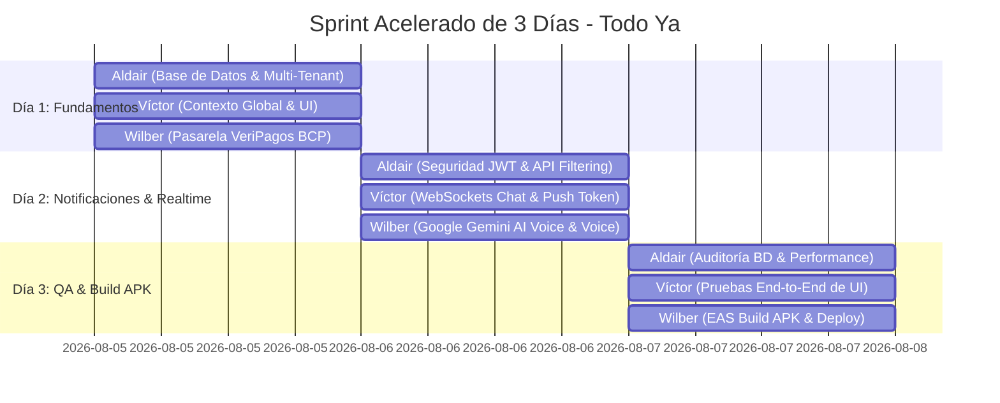

# 🚀 Plan de Sprint Acelerado de 3 Días — Todo Ya

Este documento contiene la hoja de ruta de desarrollo intensivo de **3 días** para organizar al equipo (**Aldair, Víctor y Wilber**) y llevar el proyecto **Todo Ya** a un estado de producción con ejecutable `.apk`.

---

## 👥 Roles del Equipo

* **👤 Aldair — Backend & Arquitectura de Datos:** Responsable de Neon.db, Drizzle ORM, tablas `tenants`, tokens JWT y seguridad de API Routes.
* **👤 Víctor — Frontend UI/UX & Notificaciones:** Responsable del estado React Native ([user-context.tsx](file:///c:/Users/PCZ/Desktop/todo-ya/src/context/user-context.tsx)), chat en tiempo real y notificaciones push nativas.
* **👤 Wilber — Integraciones, Pagos & DevOps:** Responsable de VeriPagos BCP, Google Gemini AI y generación del paquete ejecutable Android (.APK con EAS Build).

---

## 🗓️ Calendario de Ejecución (Sprint de 3 Días)



---

### 📅 DÍA 1: Arquitectura Multi-Tenant, Contexto y Pagos QR

#### 👤 ALDAIR (Backend & BD)
- [ ] Crear la tabla `tenants` en [schema.ts](file:///c:/Users/PCZ/Desktop/todo-ya/src/db/schema.ts) con campos: `id`, `nombre`, `tipo`, `nit`, `createdAt`.
- [ ] Agregar la columna `tenantId` en las tablas `users` y `orders`.
- [ ] Actualizar [localDb.ts](file:///c:/Users/PCZ/Desktop/todo-ya/src/db/localDb.ts) y [local_db.json](file:///c:/Users/PCZ/Desktop/todo-ya/local_db.json) con soporte offline para `tenants`.

#### 👤 VÍCTOR (Frontend & UI)
- [ ] Actualizar las interfaces `UsuarioRegistrado` y `Order` en [user-context.tsx](file:///c:/Users/PCZ/Desktop/todo-ya/src/context/user-context.tsx) agregando `tenantId`.
- [ ] Añadir `activeTenant` y la función `switchTenant()` al contexto global.
- [ ] Crear selector visual de espacio de trabajo/empresa en el perfil del usuario.

#### 👤 WILBER (Pagos & Integraciones)
- [ ] Conectar la API de **VeriPagos BCP** en [veripagos+api.ts](file:///c:/Users/PCZ/Desktop/todo-ya/src/app/api/veripagos+api.ts).
- [ ] Generar QR dinámico real para la compra de monedas de proveedores.
- [ ] Crear el endpoint webhook para confirmación automática de pago.

---

### 📅 DÍA 2: Seguridad JWT, Chat Instantáneo & IA

#### 👤 ALDAIR (Backend & BD)
- [ ] Generar tokens JWT en el inicio de sesión y registro de usuarios en [users+api.ts](file:///c:/Users/PCZ/Desktop/todo-ya/src/app/api/users+api.ts).
- [ ] Implementar middleware de validación `Authorization: Bearer <token>`.
- [ ] Filtrar las consultas de [orders+api.ts](file:///c:/Users/PCZ/Desktop/todo-ya/src/app/api/orders+api.ts) y [chat+api.ts](file:///c:/Users/PCZ/Desktop/todo-ya/src/app/api/chat+api.ts) por `tenantId`.

#### 👤 VÍCTOR (Frontend & UI)
- [ ] Reemplazar el polling HTTP (6s) por WebSockets/SSE para recepción instantánea de chat.
- [ ] Configurar `expo-notifications` para capturar el `pushToken` del celular.
- [ ] Disparar alertas nativas cuando el usuario reciba un mensaje o le asignen un trabajo con la app cerrada.

#### 👤 WILBER (Pagos & Integraciones)
- [ ] Probar y calibrar la integración con **Google Gemini AI** en [matching+api.ts](file:///c:/Users/PCZ/Desktop/todo-ya/src/app/api/matching+api.ts).
- [ ] Garantizar la transcripción de notas de voz enviadas por clientes al solicitar un trabajo.
- [ ] Ajustar la clasificación automática de categorías y presupuesto sugerido por la IA.

---

### 📅 DÍA 3: Pruebas de Integración, QA y Compilación .APK

#### 👤 ALDAIR (Backend & BD)
- [ ] Ejecutar prueba de carga en Neon PostgreSQL para garantizar cero errores en producción.
- [ ] Verificar que no existan fugas de información entre distintos `tenantId`.

#### 👤 VÍCTOR (Frontend & UI)
- [ ] Ejecutar el flujo completo de prueba (Registro Cliente ➔ Solicitud por voz ➔ Notificación al Proveedor ➔ Asignación de Trabajo ➔ Chat ➔ Calificación).
- [ ] Verificar la interfaz en pantallas de Android, iOS y Web.

#### 👤 WILBER (Pagos & Integraciones)
- [ ] Configurar archivo `eas.json` para compilación nativa Android.
- [ ] Ejecutar comando de compilación: `npx eas build -p android --profile preview`.
- [ ] Entregar el archivo ejecutable **.APK** listo para instalar en cualquier teléfono celular.

---

## 🤖 Prompts de Trabajo Individuales (Copiar y Pegar)

### 📌 Prompt para ALDAIR (Backend & DB)
```text
Hola. Soy ALDAIR y estoy a cargo del Backend y Base de Datos en Todo Ya (Expo + Neon.db + Drizzle ORM).
Mi objetivo de hoy es: [Escribe la tarea del día, ej: Implementar la tabla tenants y la columna tenantId en schema.ts].
Por favor, analiza schema.ts y localDb.ts en el proyecto y dame el código exacto listo para integrar sin romper las relaciones existentes.
```

### 📌 Prompt para VÍCTOR (Frontend & UI)
```text
Hola. Soy VÍCTOR y estoy a cargo del Frontend y Notificaciones en Todo Ya (React Native + Expo Router).
Mi objetivo de hoy es: [Escribe la tarea del día, ej: Actualizar user-context.tsx para soportar activeTenant y switchTenant].
Por favor, revisa src/context/user-context.tsx y proporciona la actualización exacta conservando los estados actuales.
```

### 📌 Prompt para WILBER (Pagos, IA & DevOps)
```text
Hola. Soy WILBER y estoy a cargo de las Integraciones (VeriPagos BCP, Gemini AI) y Compilación de Todo Ya.
Mi objetivo de hoy es: [Escribe la tarea del día, ej: Configurar EAS Build para generar el ejecutable .APK de Android].
Por favor, guía el proceso paso a paso con los comandos y archivos de configuración exactos.
```
