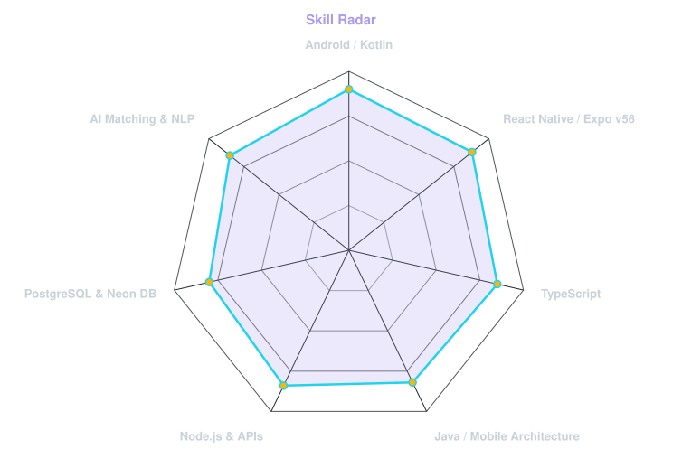
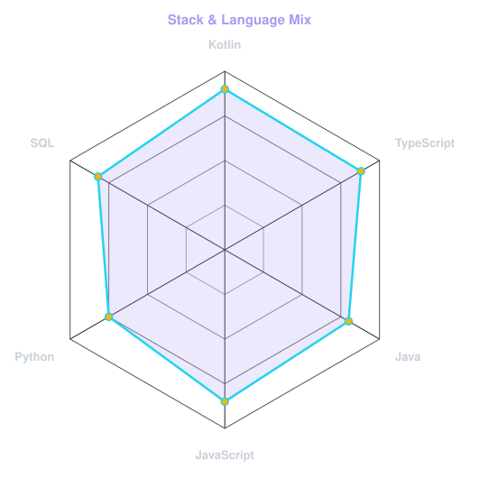

<!-- TERMINAL BANNER - profile.sh --live (Dynamic Dark/Light SVG) -->
<picture>
  <source media="(prefers-color-scheme: dark)"  srcset="assets/banner-dark.svg">
  <source media="(prefers-color-scheme: light)" srcset="assets/banner-light.svg">
  
</picture>

  

<!-- NAME / TAGLINE - animated typing -->

  

<!-- SOCIALS — Styled Shields Badges matching emmi-lili style -->
&nbsp;&nbsp;
&nbsp;&nbsp;

  

<!-- PROFILE VIEWS BADGE -->

---

## 🙋‍♂️ This is me :) / Sobre Mí

Hi, I'm **Luis Merma (Wasausky16)**, Mobile & Full Stack Software Engineer broadcasting from Perú 🇵🇪.
I build intuitive cross-platform applications and real-time backend systems, passionate about bridging technology and everyday life.

- 🚀 **Creator & Lead Architect at [Todo Ya](https://github.com/Wasausky16/todo-ya)**: connecting local services with customers in minutes using React Native, Expo v56, and Google Gemini AI.
- 📱 **Mobile Specialist**: Android native development (Kotlin, Java) and cross-platform architecture (React Native, Expo, Flutter).
- 🤖 **AI & Agents Enthusiast**: integrating NLP, 2-level semantic matching, and multimodal identity verification (KYC).
- 🌱 **My Mission**: Building software that delivers real-world impact for communities across LATAM.
- 💬 Talk to me about **Mobile Architecture, AI Engines & Startup Scaling** in LATAM!

 

## 🛠️ my perfect stack

---

## 📡 signals & skill radar

<table>
<tr>
<td width="50%" align="center" valign="middle">

<!-- Self-rated skill radar -->
<picture>
  <source media="(prefers-color-scheme: dark)"  srcset="assets/radar-dark.svg">
  <source media="(prefers-color-scheme: light)" srcset="assets/radar-light.svg">
  
</picture>

</td>
<td width="50%" align="center" valign="middle">

<!-- Language stack radar -->
<picture>
  <source media="(prefers-color-scheme: dark)"  srcset="assets/radar-langs-dark.svg">
  <source media="(prefers-color-scheme: light)" srcset="assets/radar-langs-light.svg">
  
</picture>

</td>
</tr>
</table>

---

## 📊 Numbers matter? ohhh yes.

  
  

 

  

---

` Build with love · @Wasausky16 `

