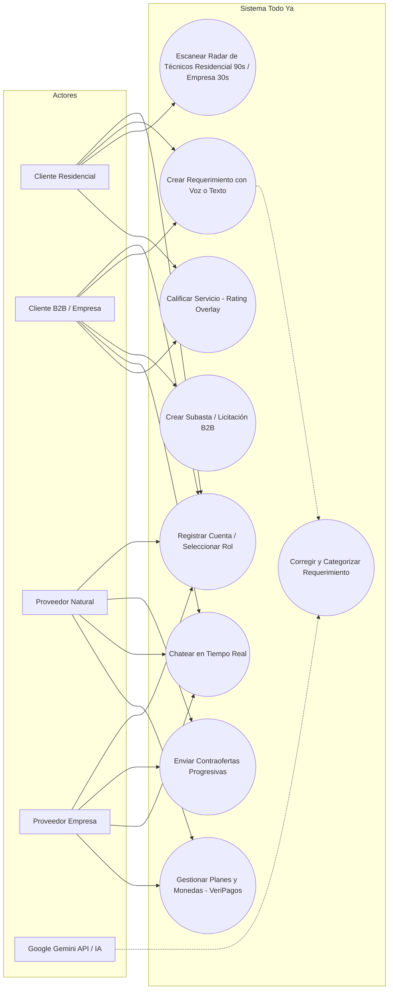
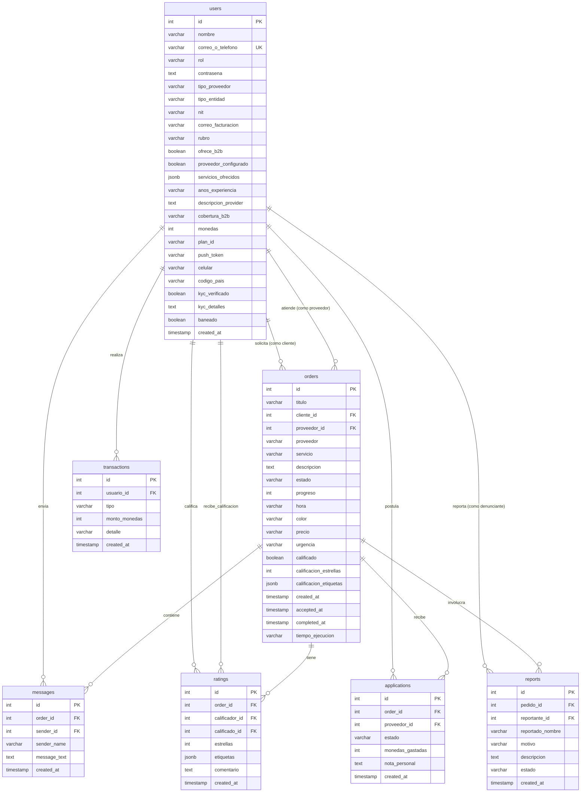

# Sustentación Académica y Propuesta Técnica — Todo Ya 🚀

Este documento detalla la fundamentación académica, la pertinencia, la arquitectura del software y la propuesta técnica del proyecto **Todo Ya** para ser adjuntado como soporte al prototipo desarrollado.

---

## 📋 1. Resumen Ejecutivo del Prototipo
**Todo Ya** es una plataforma móvil universal y web (desarrollada con **React Native, Expo, Drizzle ORM, Neon.db e i18n**) que conecta clientes con proveedores de servicios generales en tiempo real. Dispone de dos flujos separados y optimizados:
1. **Residencial (B2C):** Búsqueda inmediata de técnicos (plomeros, electricistas, pintores) mediante un radar de 90 segundos con tarifas y radios dinámicos y mapas interactivos.
2. **Corporativo (B2B):** Sistema de subastas invertidas y contraofertas progresivas (radar de 30 segundos) con chat de negociación en vivo para insumos y servicios industriales.

---

## 📝 2. Introducción
En la última década, la digitalización ha transformado la forma en que las personas y las organizaciones acceden a los servicios. La economía de plataformas (*gig economy*) ha facilitado la intermediación laboral, pero la mayoría de las soluciones del mercado se enfocan únicamente en un rol transaccional básico y descuidan los aspectos de inclusión lingüística y las necesidades específicas del sector empresarial (B2B). 

El proyecto **Todo Ya** surge como un esfuerzo técnico y social para diseñar un entorno inclusivo, seguro y ágil que no solo atienda al cliente final urbano, sino que integre activamente a los trabajadores independientes de oficios técnicos de diversas culturas e idiomas y proporcione a las empresas un canal directo y transparente para sus licitaciones cotidianas.

---

## 🔎 3. Planteamiento del Problema
El desarrollo de este proyecto responde a tres problemáticas críticas identificadas en el contexto nacional y latinoamericano:
1.  **Informalidad e Inseguridad en el Sector Técnico:** La contratación de servicios generales de reparación domiciliar (plomería, electricidad, cerrajería) carece de regulación, lo que expone a los clientes residenciales a tarifas injustas y problemas de seguridad. Asimismo, los técnicos independientes no cuentan con herramientas para construir un perfil digital de confianza.
2.  **Ineficiencia en Adquisiciones B2B:** Las pequeñas y medianas empresas (PyMEs) enfrentan largas cadenas burocráticas y fricciones al momento de cotizar insumos o servicios corporativos. Los procesos de licitación física toman días y carecen de un canal de negociación ágil y directo.
3.  **Brecha Digital y Barrera Idiomática (Exclusión Cultural):** Muchas de las aplicaciones móviles de servicios generales se desarrollan únicamente en español o inglés, excluyendo a trabajadores e independientes cuya lengua materna y cotidiana es de origen indígena (como el Quechua, Aymara o Guaraní). Esto restringe su incorporación a la economía digital formal.

---

## 🎯 4. Objetivos del Proyecto

### Objetivo General:
Desarrollar un prototipo de aplicación universal multiplataforma (Móvil y Web) para la intermediación de servicios generales y licitaciones B2B en tiempo real, integrando persistencia distribuida con base de datos Postgres serverless, adaptabilidad visual e internacionalización multicultural accesible.

### Objetivos Específicos:
1.  Diseñar e implementar un sistema estricto de roles de usuario (Cliente natural vs. Empresa B2B) que filtre dinámicamente las pantallas de acuerdo al tipo de entidad registrada.
2.  Desarrollar un formulario interactivo inteligente con la API de Google Gemini (modelo gemini-2.5-flash) que admita entrada de voz real (micrófono con MediaRecorder) y texto libre en lenguaje natural, corrigiendo errores ortográficos y gramaticales (ej. 'tengo un fga de gua' -> 'Tengo una fuga de agua'), clasificando automáticamente el servicio, estimando costos, y rechazando entradas incoherentes o sin sentido con el mensaje "Vuelve a escribirlo" mediante filtros online (IA) y offline (heurísticos locales).
3.  Implementar un flujo de búsqueda residencial (B2C) interactivo por mapa con una cuenta regresiva de 90 segundos mediante un radar de escaneo animado, con un algoritmo de ajuste dinámico de radio de cobertura y cobro de consulta basado en el tiempo transcurrido.
4.  Crear un módulo corporativo (B2B) de subastas en vivo donde proveedores de insumos compitan enviando contraofertas progresivas (a la baja o al alza por servicios premium) con un chat de negociación en vivo.
5.  Desarrollar un sistema de calificación forzada con bloqueo de interfaz raíz (Rating Overlay) para garantizar la retroalimentación de los trabajos completados.
6.  Integrar un módulo de traducción i18n para soportar 5 idiomas principales: Español, Inglés, Quechua, Aymara y Guaraní.
7.  Configurar la arquitectura de backend mediante Expo API Routes conectadas a Drizzle ORM y base de datos relacional Neon.db.
8.  Implementar un modelo híbrido de persistencia nativa segura (cifrado con SecureStore y almacenamiento persistente estructurado con AsyncStorage) y flujos de eliminación física de cuentas en cumplimiento con las directrices de seguridad y políticas de privacidad requeridas para la publicación comercial en Google Play Store.
9.  Desarrollar un sistema regional de registro con número celular latinoamericano, doble factor PIN por SMS, verificación de identidad KYC para prestadores de servicios técnicos y un módulo de denuncias con baneo administrativo para garantizar la seguridad y reputación del ecosistema.

---

## 💡 5. Propuesta de Valor

La propuesta de valor de **Todo Ya** se segmenta de acuerdo a los tres actores principales del ecosistema:

*   **Para Clientes Residenciales:** Ofrece rapidez, transparencia tarifaria (precios de mercado) y tranquilidad mediante un sistema de reputación verificado y geolocalización en tiempo real.
*   **Para Empresas (Clientes B2B):** Proporciona un mecanismo ágil para publicar requerimientos y recibir múltiples ofertas y contraofertas competitivas en minutos, con facilidades para coordinar la facturación formal e insumos.
*   **Para Proveedores (Técnicos y Empresas Proveedoras):** Les brinda una vitrina digital gratuita para captar clientes, establecer su propia reputación (independiente de su idioma de preferencia) y postularse mediante un sistema de suscripción mensual estructurado en 3 niveles (Planes 1, 2 y 3 para naturales; Planes Empresa 1, 2 y 3 para corporativos) que regula el tipo y cantidad de accesos a leads.

---

## 📐 6. Memoria de Cálculo (Fórmulas y Algoritmos)

El prototipo implementa dos algoritmos clave para la automatización de la interfaz y la asignación:

### A. Algoritmo de Distancia de Geolocalización (Haversine Simulado)
Para el renderizado de pines de proveedores en el radio de cobertura del cliente (5 km en B2C, 10 km en B2B), se proyectan las distancias cartesianas estimando la curvatura de la tierra:

$$d = 2r \cdot \arcsin\left(\sqrt{\sin^2\left(\frac{\Delta \phi}{2}\right) + \cos(\phi_1)\cos(\phi_2)\sin^2\left(\frac{\Delta \lambda}{2}\right)}\right)$$

Donde:
*   $r$ es el radio terrestre ($6371\text{ km}$).
*   $\phi_1, \phi_2$ son las latitudes de ambos puntos en radianes.
*   $\Delta \phi, \Delta \lambda$ representan la diferencia de latitud y longitud.

En el simulador web (`map-view.tsx`), se efectúa una aproximación euclidiana simplificada para el cálculo rápido de render en pantalla:

$$d_{aprox} = \sqrt{(\Delta \text{lat})^2 + (\Delta \text{lon})^2} \times 111.12\text{ km}$$

### B. Algoritmo del Generador de Contraofertas Adaptativas B2B
El simulador de proveedores B2B calcula las contraofertas dinámicas en base al Presupuesto Objetivo ($P_{obj}$) definido por la empresa compradora y un factor aleatorio ponderado de variación:

$$C_{i} = P_{obj} \cdot (1 + \delta_{i})$$

Donde:
*   $C_{i}$ es el precio de cotización propuesto por el proveedor $i$.
*   $\delta_{i}$ es el coeficiente de variación calculado como:

$$\delta_{i} = \text{random}(-0.10, 0.20) + K_{rep}$$

*   $\text{random}(a, b)$ es una distribución uniforme en el intervalo $[a, b]$. Un valor negativo representa una oferta competitiva a la baja para ganar el contrato; un valor positivo representa una propuesta al alza debido a insumos de mayor calidad.
*   $K_{rep}$ es la constante de reputación premium del proveedor (ej. $+0.05$ para técnicos con calificación $\ge 4.8\star$), justificando un cobro extra por garantía y excelencia.

### C. Algoritmo de Tarifa y Radio Dinámico Residencial (B2C)
Para incentivar la aceptación de consultas y expandir la cobertura cuando no se encuentran técnicos cercanos de manera inmediata, el prototipo residencial aumenta dinámicamente el radio de búsqueda $R(t)$ en kilómetros y el costo sugerido de la consulta $F(t)$ en función del tiempo transcurrido $t$ en segundos (donde $0 \le t \le 90$):

$$R(t) = \begin{cases} 
1.0\text{ km} & \text{si } 0 \le t \le 30 \\ 
1.5\text{ km} & \text{si } 30 < t \le 60 \\ 
2.0\text{ km} & \text{si } t > 60 
\end{cases}$$

$$F(t) = \begin{cases} 
10 & \text{si } 0 \le t \le 30 \\ 
15 & \text{si } 30 < t \le 60 \\ 
20 & \text{si } t > 60 
\end{cases}$$

### D. Algoritmo de Comisión por Plan de Suscripción
Al concretarse una asignación de pedido residencial al proveedor, el sistema calcula de forma determinista la cantidad de monedas a debitar $C_{\text{debit}}$ de su cuenta como:

$$C_{\text{debit}} = \text{round}\left(F(t) \cdot r_{\text{com}}\right)$$

Donde la tasa de comisión $r_{\text{com}}$ varía según el plan de suscripción activa del proveedor:

$$r_{\text{com}} = \begin{cases} 
0.20 & \text{para Plan 1 (Básico / default)} \\ 
0.10 & \text{para Plan 2 (Premium)} \\ 
0.00 & \text{para Plan 3 (Ilimitado)} 
\end{cases}$$

---

## 🏛️ 7. Sustentación Académica y Pertinencia

### A. Pertinencia con las necesidades de la sociedad y empresa
El proyecto ataca de raíz el problema de la informalidad y la brecha digital en América Latina. La unificación en un solo prototipo híbrido de flujos B2C y B2B demuestra la viabilidad de plataformas unificadas de servicios que dinamizan tanto la economía del hogar como el aprovisionamiento corporativo de oficina.

### B. Grado de innovación y originalidad
La principal innovación radica en la internacionalización multicultural (i18n) a lenguas originarias de la región andina y amazónica (Quechua, Aymara, Guaraní). Esto no solo es una ventaja de accesibilidad, sino una herramienta de inclusión y dignificación del trabajador técnico. Además, el modelo de contraofertas en vivo (inspirado en modelos peer-to-peer disruptivos como inDriver) ofrece una flexibilidad de la que carecen los marketplaces clásicos de comercio y contratación.

### C. Impacto social y técnico
*   **Social:** Democratización tecnológica para plomeros, electricistas y pintores independientes que habitualmente operan de manera informal y analógica.
*   **Técnico:** Consolidación de un backend serverless altamente escalable (Expo Router API Routes + Drizzle + Neon) que permite tiempos de respuesta ultra rápidos y el despliegue del prototipo tanto en tiendas móviles (Android/iOS) como en navegadores de escritorio.

### D. Dominio y sustentación de la temática del proyecto
Se demuestra un profundo dominio en:
*   *Desarrollo Full-Stack y Estado Global:* Lógica síncrona/asíncrona mediante Context API, autenticación protegida (Auth Guards) y layouts dinámicos.
*   *Bases de Datos Relacionales:* Uso de ORM modernos (Drizzle) para el modelado de esquemas relacionales consistentes.
*   *Ingeniería de Usabilidad (UX/UI):* Diseño premium, responsivo y adaptivo con transiciones de color de marca unificadas (Dorado para residencial, Slate/Morado para B2B).

### E. Propuesta académica contenida en el proyecto
El proyecto funciona como un material didáctico universitario para asignaturas de desarrollo móvil, ingeniería web, modelado de sistemas de información e interacción humano-computador (IHC), sirviendo de base conceptual para tesis de grado sobre economías colaborativas.

### F. Pertinencia con el área de especialidad (Ingeniería de Sistemas/Software)
Se alinea estrictamente al perfil de egreso del ingeniero, fomentando el desarrollo de competencias en desarrollo nativo móvil, administración de base de datos distribuidas en la nube, optimización de algoritmos de matching, y el diseño de interfaces accesibles e inclusivas acordes al entorno demográfico del país.

---

## 🏁 8. Conclusiones
1.  **Viabilidad de la Arquitectura:** Se comprobó que el stack tecnológico compuesto por **React Native / Expo, Drizzle ORM, Neon.db e i18n** permite desarrollar un sistema multiplataforma altamente fluido, reactivo y de bajo consumo de recursos, ideal para el mercado latinoamericano.
2.  **Solución a la Fragmentación de Roles:** La separación lógica y estricta de roles por tipo de entidad (Natural vs. Empresa) resolvió la confusión de flujos, unificando la estética B2B (slate e índigo) e impidiendo desviaciones a pantallas incompatibles.
3.  **Inclusión Lingüística Exitosa:** La incorporación de traducciones i18n al Quechua, Aymara y Guaraní demostró que es posible construir interfaces tecnológicas complejas que respeten y promuevan la identidad cultural de los trabajadores de oficios generales.
4.  **Resiliencia y Accesibilidad en Entrada de Voz:** Se validó que la combinación de captura de audio real via `MediaRecorder` y transcripción asíncrona por IA incrementa la accesibilidad y velocidad de carga de requerimientos. El diseño híbrido del validador (online con Gemini y fallback heurístico local offline) garantiza que la entrada de texto sin sentido sea rechazada de forma consistente con el mensaje "Vuelve a escribirlo", aun bajo restricciones técnicas como límites de cuota (error 429).
5.  **Alineación Comercial y Monetización del Proveedor:** Se demostró la viabilidad de un modelo de negocio sostenible en la gig economy local mediante la integración de un monedero digital (`monedas`). El sistema de comisiones estructurado cobra de forma justa y en caliente de acuerdo al nivel del plan mensual del proveedor, incentivando el salto a planes premium de menor tasa impositiva.

---

## 💡 9. Recomendaciones
1.  **Integración de Pasarelas de Pago Reales:** Para la fase productiva, se recomienda perfeccionar los canales de cobro (como pasarelas de tarjetas de crédito o integración de Simple QR real en producción) para automatizar la contratación y renovación de los planes de suscripción de proveedores.
2.  **Geolocalización por GPS Nativo:** Reemplazar el motor de mapa Leaflet simulado por el SDK nativo de Google Maps (Android) y Apple Maps (iOS) utilizando `expo-location` para obtener coordenadas exactas en tiempo real.
3.  **Modelos de Clasificación Híbridos:** Continuar afinando la calibración y el ajuste de temperatura en la llamada a la API de Gemini (modelo `gemini-1.5-flash`), expandiendo los esquemas JSON de respuesta para detectar sub-servicios y pre-diagnósticos técnicos automatizados de forma más detallada.

---

## 📎 10. Anexos

### Anexo A: Estructura Conceptual del Storage Local
El prototipo persiste su estado simulando base de datos locales mediante claves JSON:
*   `todo_ya_active_user`: Objeto del usuario logueado en la sesión.
*   `todo_ya_registered_users`: Array de usuarios del sistema (Clientes, Proveedores y Empresas).
*   `todo_ya_orders`: Historial de pedidos creados y cotizaciones en curso.
*   `todo_ya_role`: Rol activo de la sesión actual (`'client' | 'provider' | 'business'`).

### Anexo B: Estructura de Traducción Multicultural (i18n)
Fragmento del esquema de internacionalización implementado en `src/i18n/index.ts`:
```typescript
const resources = {
  es: { translation: { welcome: "Bienvenido", switchRole: "Cambiar de Rol" } },
  en: { translation: { welcome: "Welcome", switchRole: "Switch Role" } },
  qu: { translation: { welcome: "Allillamanta Chayay", switchRole: "Rurayta Tikray" } },
  ay: { translation: { welcome: "Jilimanta Puruma", switchRole: "Luraña Mayjt'ayaña" } },
  gn: { translation: { welcome: "Maitei", switchRole: "Mba'apo Mboheko" } }
};
```

### Anexo C: Diagramas de Diseño del Sistema (Mermaid)

Para sustentar técnicamente el desarrollo del prototipo de **Todo Ya**, se detallan a continuación los diagramas de modelado de negocio y de software:

#### 1. Diagrama de Casos de Uso
Ilustra el alcance del prototipo indicando cómo interactúan los clientes (residenciales y corporativos) y los proveedores (naturales y jurídicos) con las principales funciones del sistema y el motor de IA.



#### 2. Diseño Lógico de la Base de Datos (Modelo Entidad-Relación)
Muestra la estructura lógica de almacenamiento persistente en la nube relacional (Neon.db PostgreSQL) construida a través del modelado de Drizzle ORM:



#### 3. Diagrama de Arquitectura del Software
Representa la separación de responsabilidades y flujo de datos entre las capas de presentación, controlador de API y base de datos e IA en la nube:

```mermaid
graph TD
    subgraph Cliente (Front-End)
        App[React Native / Expo App]
        Web[Web PWA]
        I18n[Módulo i18n Quechua/Aymara/Guaraní/ES/EN]
        Map[Leaflet / GPS Map View]
    end

    subgraph Servidor (Back-End Serverless)
        Routes[Expo API Routes]
        Transcribe[/api/transcribe]
        Matching[/api/matching]
        Users[/api/users]
        Reports[/api/reports]
        Drizzle[Drizzle ORM]
    end

    subgraph Servicios Externos
        Gemini[Google Gemini API - gemini-2.5-flash]
        Neon[Neon.db Postgres Serverless]
    end

    App & Web --> Routes
    App & Web --> I18n
    App & Web --> Map

    Routes --> Transcribe & Matching & Users & Reports
    
    Transcribe --> Gemini
    Matching --> Gemini
    
    Users --> Drizzle
    Reports --> Drizzle
    Drizzle --> Neon
```
```
