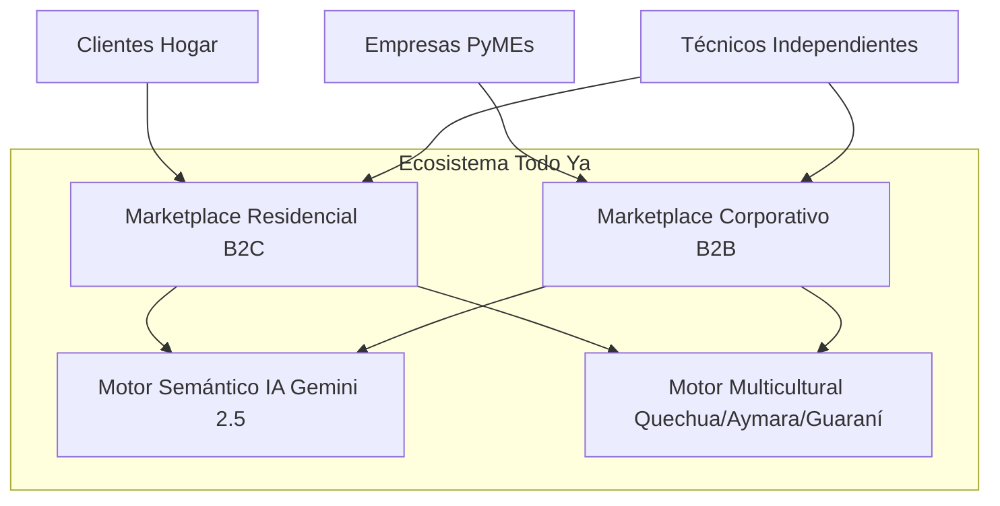
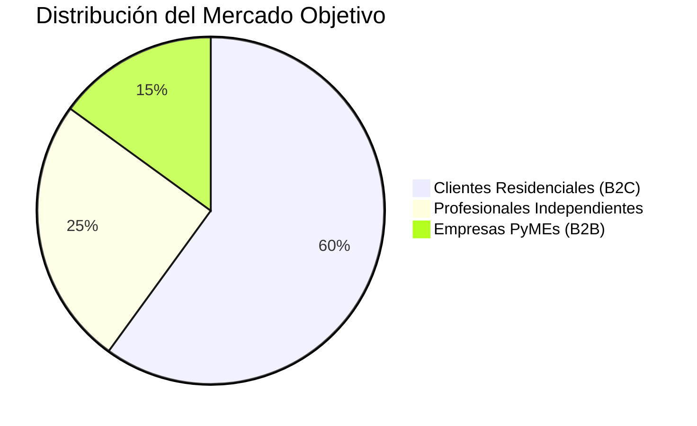
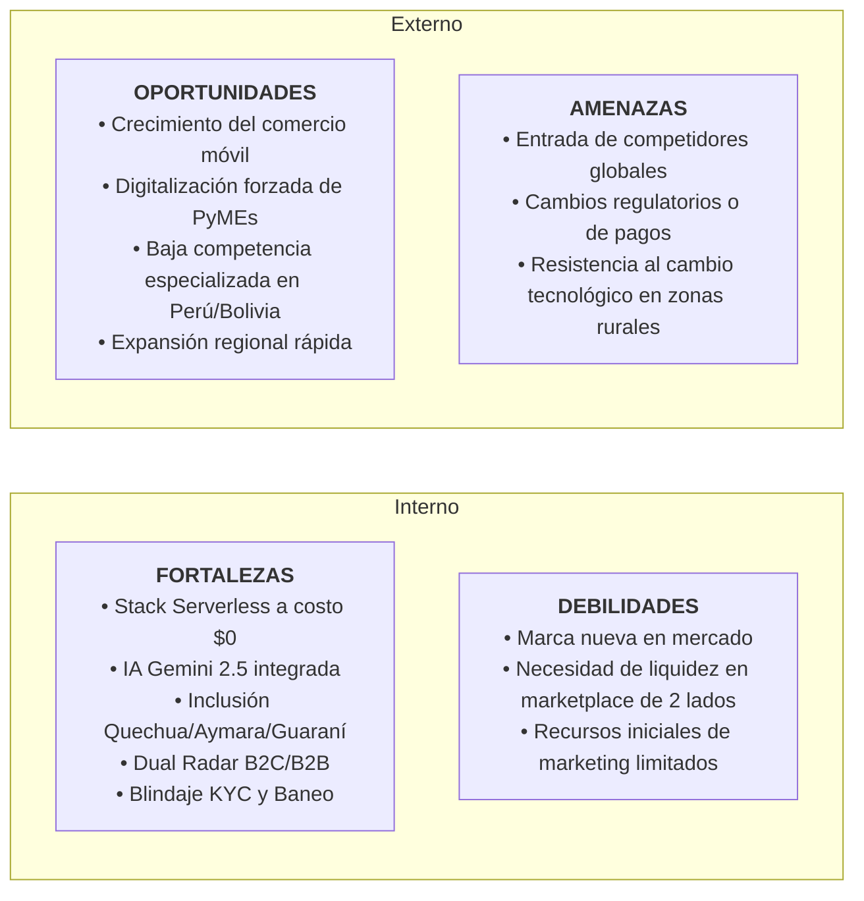
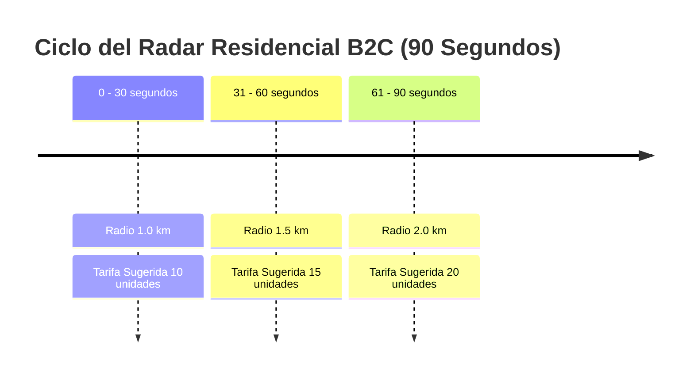
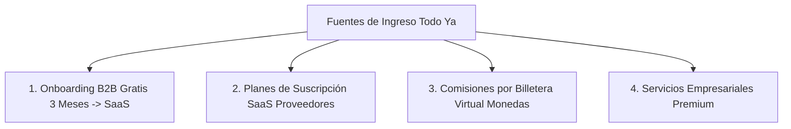
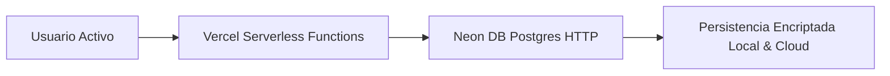
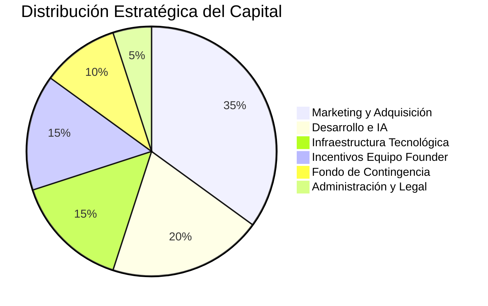
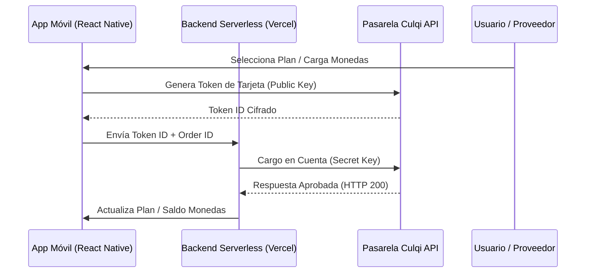

# DOSSIER MAESTRO DE INVERSIÓN Y ESTUDIO DE MERCADO — TODO YA 🚀

***Plataforma SaaS B2B y B2C para Servicios Locales e Internacionales con Inteligencia Artificial e Inclusión Multicultural***

*Documento Estratégico Unificado para Inversionistas: Consolidación del Estudio de Mercado, Sostenibilidad Financiera, Integración de Pasarela de Pagos (Culqi/BCP) y Formalización Corporativa S.A.C. con RUC 20.*

---

## 📌 1. RESUMEN EJECUTIVO (EXECUTIVE SUMMARY)

### 1.1 Visión del Proyecto
**Todo Ya** es una solución tecnológica universal (aplicación móvil multiplataforma Android/iOS y Web PWA) que revoluciona el sector de contratación de servicios técnicos residenciales (**B2C**) y las compras o licitaciones de mantenimiento de pequeñas y medianas empresas (**B2B**).

Nuestra plataforma elimina la informalidad, la ineficiencia administrativa y la exclusión cultural en Latinoamérica mediante un ecosistema digital guiado por Inteligencia Artificial (**Google Gemini 2.5 Flash**), geolocalización en tiempo real e internacionalización en lenguas originarias (**Quechua, Aymara, Guaraní**, junto con Español e Inglés).

---



---

### 1.2 La Oportunidad de Inversión
En Latinoamérica existen millones de profesionales independientes de oficios técnicos (plomeros, electricistas, pintores, técnicos en refrigeración) y cientos de miles de PyMEs que sufren diariamente por procesos lentos, inseguros e informales. 

**Todo Ya** capta esta oportunidad mediante una infraestructura tecnológica **Serverless de costo ultra bajo ($0 en etapa inicial)** y un modelo de monetización híbrido (**Suscripciones SaaS + Comisiones por Billetera Virtual + Módulos Corporativos**).

### 1.3 Indicadores Clave de Impacto y Eficiencia (Highlights)
* **Arquitectura Lean Serverless**: Operación inicial a **USD 0/mes** en costos de servidores, escalando de manera responsable conforme crece la base de usuarios.
* **Punto de Equilibrio Acelerado**: Con solo **10 profesionales suscritos** al Plan Profesional (USD 5/mes), la plataforma cubre el **100% de sus costos tecnológicos proyectados para el primer año**.
* **Doble Motor de Adquisición B2B**: Estrategia de **3 meses de prueba sin costo para empresas compradoras**, generando hábito y conversión orgánica a suscripciones mensuales.
* **Inclusión Cultural Propietaria**: Monopoly regional en comunidades andinas y amazónicas al ser la **primera y única app traducida nativamente a Quechua, Aymara y Guaraní**.
* **Formalización Legal**: Estructura societaria definida como **Sociedad Anónima Cerrada (S.A.C.)** bajo **RUC 20** constituida a través del programa **BCP Crece**, garantizando seguridad jurídica para nuevos inversionistas y capacidad de facturación electrónica (SUNAT).

---

## ⚡ 2. ANÁLISIS DE MERCADO Y OPORTUNIDAD COMERCIAL

### 2.1 El Problema del Mercado: Tres Dolores Críticos
El sector de servicios locales en Latinoamérica presenta tres fallas estructurales:

1. **Informalidad y Desconfianza Residencial (Clientes B2C)**:
   - Contratación basada en recomendaciones informales o redes sociales.
   - Precios arbitrarios, falta de referencias verificadas y riesgo de fraude o robos.
   - Incertidumbre sobre la disponibilidad inmediata de profesionales capacitados.
2. **Invisibilidad e Inseguridad Financiera (Técnicos Independientes)**:
   - Alta dependencia del "boca a boca", generando ingresos irregulares y fluctuantes.
   - Escasa presencia digital y falta de herramientas de gestión de clientes.
   - Pérdida de oportunidades frente a empresas formales por falta de canales de difusión.
3. **Burocracia e Ineficiencia Administrativa (Empresas PyMEs)**:
   - Proceso manual y lento para solicitar cotizaciones de mantenimiento y reparaciones de oficina.
   - Pérdida de horas hombre en llamadas telefónicas y comparación de presupuestos.
   - Falta de historial centralizado de contrataciones y proveedores verificados.

---

### 2.2 Público Objetivo y Segmentación de Mercado



| Segmento | Descripción | Servicios Principales |
| :--- | :--- | :--- |
| **Segmento 1: Clientes Residenciales (B2C)** | Personas y familias que requieren reparaciones, instalaciones o mantenimiento del hogar de forma urgente o programada. | Plomería, Electricidad, Pintura, Refrigeración, Albañilería, Cerrajería, Jardinería, Limpieza. |
| **Segmento 2: Profesionales Independientes** | Técnicos capacitados de oficios generales que buscan aumentar su cartera de clientes y digitalizar su actividad. | Electricistas, Plomeros, Carpinteros, Técnicos en Aire Acondicionado, Soldadores, Mecánicos. |
| **Segmento 3: Empresas (B2B)** | Pequeñas y medianas empresas que requieren contrataciones recurrentes de servicios y provisión de insumos. | Restaurantes, Hoteles, Oficinas, Instituciones Educativas, Constructoras, Comercios, Clínicas. |

---

### 2.3 Tamaño del Mercado (TAM / SAM / SOM)

#### Mercado Total Direccionable (TAM)
Latinoamérica cuenta con más de **45 millones de trabajadores independientes** de oficios técnicos y más de **15 millones de PyMEs** en busca de soluciones operativas locales.

#### Mercado Disponible Servible (SAM)
Población urbana con acceso a smartphones y pagos digitales en el bloque Andino inicial (Perú, Bolivia, Ecuador y Colombia), representando un mercado potencial de más de **8 millones de usuarios**.

#### Mercado Objetivo Inicial (SOM)
Lanzamiento y validación del MVP enfocado en las principales capitales comerciales de Perú y Bolivia durante el primer año:
* **Perú**: Lima y Arequipa.
* **Bolivia**: Santa Cruz de la Sierra, La Paz y Cochabamba.

---

### 2.4 Análisis de la Competencia y Ventajas Comparativas

Actualmente existen plataformas globales y regionales de intermediación; sin embargo, la mayoría están hiper-especializadas en un solo nicho (servicios digitales o remodelaciones grandes) y descuidan las necesidades del mercado técnico cotidiano y multicultural latinoamericano.

#### Matriz Comparativa de Competidores

| Plataforma | Servicios Hogar (B2C) | Licitaciones Empresas (B2B) | Radar Geolocalizado | Suscripción SaaS | Monedas / Comisión | Idiomas Originarios | Presencia en LatAm |
| :--- | :---: | :---: | :---: | :---: | :---: | :---: | :---: |
| **TaskRabbit** | SÍ | NO | SÍ | NO | Comisión alta | NO | Muy Baja |
| **Thumbtack** | SÍ | NO | NO | NO | Pago por Lead | NO | Nula |
| **Habitissimo** | SÍ | SÍ | NO | Parcial | Parcial | NO | Media |
| **Cronoshare** | SÍ | SÍ | NO | Créditos | Parcial | NO | Media |
| **Workana** | NO (Digital) | SÍ | NO | NO | Comisión | NO | Alta |
| **Fiverr** | NO (Digital) | SÍ | NO | NO | Comisión | NO | Alta |
| **Todo Ya** 🚀 | **SÍ** | **SÍ** | **SÍ** | **SÍ** | **SÍ** | **SÍ (Quechua/Aymara/Guaraní)** | **Líder Focalizado** |

---

### 2.5 Análisis FODA (SWOT)



---

## 💡 3. INNOVACIÓN TECNOLÓGICA E IMPLEMENTACIONES PROPIETARIAS

**Todo Ya** no es un prototipo conceptual; es una aplicación totalmente funcional construida sobre **Expo SDK 56**, **React Native 0.85** y **TypeScript 6.0**, que integra ventajas tecnológicas de última generación:

### 3.1 Motor de Búsqueda Semántica de 2 Niveles con IA (`gemini-2.5-flash`)
1. **Corrección Gramatical y Ortográfica Automática**: El usuario ingresa su necesidad por voz o texto libre (ej. *"tengo un fga de gua y no ahy agua"*). La IA de Gemini analiza el texto en tiempo real, corrigiéndolo a *"Tengo una fuga de agua y no hay agua"*, identificando la categoría (**Plomería**) y clasificando la urgencia (**Normal** o **Alta**).
2. **Emparejamiento Semántico Profundo**: 
   - **Nivel 1**: Categorización básica del servicio.
   - **Nivel 2**: Análisis semántico profundo en la biografía del proveedor, posicionando al especialista exacto en la posición #1 con la insignia `✨ IA Match`.
3. **Filtro de Coherencia Spam**: Sistema de protección dual (online vía Gemini API y offline vía NLP heurístico) que detecta texto incoherente ("asdfasdf", "12345") y alerta al usuario impidiendo la creación de órdenes falsas.

---

### 3.2 Entrada Multimodal: Transcripción de Notas de Voz en Tiempo Real
Permite a usuarios con baja alfabetización digital grabar sus requerimientos hablando por el micrófono mediante la API `MediaRecorder`. El backend serverless (`/api/transcribe`) procesa el audio en Base64 con Gemini API y lo convierte instantáneamente en texto corregido.

---

### 3.3 Motor Multicultural de Inclusión Social (i18n)
Primera plataforma en Latinoamérica en incorporar soporte nativo completo para lenguas originarias:
* **Quechua (`QU`)**
* **Aymara (`AY`)**
* **Guaraní (`GN`)**
* **Español (`ES`) e Inglés (`EN`)**

Esto rompe la brecha idiomática y otorga un monopolio de lealtad en la fuerza laboral técnica independiente de la región andina y amazónica.

---

### 3.4 Dual Radar Inteligente (B2C & B2B)



* **Radar B2C Residencial (90s)**: Mapea la ubicación del cliente mediante GPS / Leaflet y amplía el radio de escaneo de `1.0 km` a `2.0 km`, aplicando un tarifario dinámico transparente según la rapidez requerida.
* **Radar B2B Corporativo (30s)**: Activa un motor de subasta invertida en tiempo real donde las empresas publican su requerimiento y presupuesto objetivo, recibiendo cotizaciones y contraofertas instantáneas de proveedores pre-verificados.

---

### 3.5 Blindaje de Seguridad, KYC y Soporte Administrativo
* **Autenticación Fuerte**: Hashing de contraseñas con `scrypt` (sal aleatoria de 16 bytes y clave derivada de 64 bytes) y tokens JWT (`jose` HS256).
* **Verificación OTP PIN**: Validación de teléfono mediante código PIN enviado por WhatsApp / SMS para reducir cuentas falsas.
* **Verificación Biométrica KYC**: Los proveedores deben completar la validación de identidad subiendo foto de su documento de identidad (DNI / Carnet de Extranjería) y una selfie facial procesada con IA (Gemini Vision + Onfido/Jumio).
* **Sistema de Denuncias y Baneo en Tiempo Real**: Consola administrativa que permite suspender e inhabilitar de inmediato cuentas de proveedores reportados por mal comportamiento o cobranzas indebidas.

---

## 📊 4. MODELO DE NEGOCIO Y ESTRATEGIA DE MONETIZACIÓN HÍBRIDA

Monetizamos a través de cuatro fuentes de ingresos complementarias que garantizan estabilidad financiera y alta recurrencia:



### 4.1 Estrategia de Adquisición B2B (3 Meses Gratis)
* **Entrada de Cero Fricción**: Las nuevas empresas compradoras obtienen **3 meses de solicitudes ilimitadas sin costo**.
* **Generación de Hábito**: Durante 90 días comprueban el ahorro de tiempo y costos en compras de mantenimiento, convirtiéndose de forma natural a los planes corporativos de pago.

---

### 4.2 Esquema de Planes y Precios (SaaS)

| Plan | Precio Mensual (USD) | Precio Mensual (S/.) | Precio Mensual (Bs.) | Público Objetivo | Beneficios Principales |
| :--- | :---: | :---: | :---: | :--- | :--- |
| **Gratuito** | **USD 0** | **S/. 0** | **Bs. 0** | Nuevos profesionales | Perfil básico, radar básico, 20% comisión por servicio. |
| **Profesional** | **USD 5** | **S/. 18** | **Bs. 35** | Técnicos independientes | Mayor prioridad en radar, 10% comisión, estadísticas básicas. |
| **Premium** | **USD 10** | **S/. 36** | **Bs. 70** | Técnicos de alta actividad | Máxima prioridad, **0% comisión (SaaS puro)**, insignia dorada `Premium`. |
| **Empresa PyME** | **USD 20** | **S/. 72** | **Bs. 140** | PyMEs Compradoras | Publicación ilimitada B2B, contraofertas en vivo, historial administrativo. |
| **Enterprise** | **Personalizado** | **S/. 300 - 500+** | **Bs. 600+** | Grandes Empresas | Acceso a Cartera Nacional de Clientes, API de facturación y gestor dedicado. |

---

### 4.3 Sistema de Monedas y Comisiones Escalonadas
Cada proveedor cuenta con una **Billetera Virtual** dentro de la app. Al completarse un servicio residencial, el sistema debita automáticamente una comisión en monedas según su plan:
* **Plan Gratuito**: 20% de comisión del valor de la consulta.
* **Plan Profesional**: 10% de comisión.
* **Plan Premium**: **0% de comisión** (el profesional se queda con el 100% de su tarifa).

---

### 4.4 Justificación Económica del Retorno sobre la Inversión (ROI)
* **Para el Técnico (B2C)**: Un plomero cobra entre S/. 80 y S/. 200 por una reparación sencilla. Con **un solo servicio extra al mes** conseguido mediante Todo Ya, recupera el 100% del costo de su plan Profesional (S/. 18/mes).
* **Para la Empresa (B2B)**: Una PyME ahorra hasta 15 horas al mes en llamadas y cotizaciones manuales, lo que representa un ahorro administrativo de más de S/. 500 al mes por una suscripción de solo S/. 72/mes.

---

## 💰 5. SOSTENIBILIDAD FINANCIERA, ARQUITECTURA LEAN Y PROYECCIONES

### 5.1 Metodología Lean Startup y Arquitectura Serverless
Desarrollamos la plataforma para operar bajo el modelo **Serverless (Neon Postgres + Vercel + Expo)**, lo que elimina el pago de servidores dedicados ociosos de 24 horas. Los recursos se consumen únicamente cuando el usuario realiza una acción en la app.



---

### 5.2 Proyección de Usuarios a 3 Años

```mermaid
line
    title Proyección de Crecimiento de Usuarios Totales
    x-axis "Etapa" : "Lanzamiento", "3 Meses", "6 Meses", "1 Año", "2 Años", "3 Años"
    y-axis "Usuarios Totales" 0 --> 60000
    line [205, 820, 2050, 6650, 23500, 58200]
```

| Tiempo | Profesionales | Empresas | Clientes Hogar | Total Usuarios | Costo Mensual Infraestructura |
| :--- | :---: | :---: | :---: | :---: | :---: |
| **Lanzamiento (Mes 1)** | 50 | 5 | 150 | **205** | **USD 0** |
| **3 Meses** | 200 | 20 | 600 | **820** | **USD 0** |
| **6 Meses** | 500 | 50 | 1,500 | **2,050** | **USD 25** (Neon Launch) |
| **1 Año** | 1,500 | 150 | 5,000 | **6,650** | **USD 46** (Neon Pro + Vercel Pro) |
| **2 Años** | 5,000 | 500 | 18,000 | **23,500** | **USD 80** (Infra Ampliada) |
| **3 Años** | 12,000 | 1,200 | 45,000 | **58,200** | **USD 140** (Infra Escalable) |

---

### 5.3 Análisis del Punto de Equilibrio (Break-Even Point)
El costo de infraestructura durante el primer año se proyecta en **USD 46/mes** (aprox. S/. 170/mes). 

**Demostración Financiera**:
Con solo **10 profesionales suscritos** al Plan Profesional (USD 5/mes = USD 50/mes), el proyecto cubre el **100% de sus gastos tecnológicos operativos**. Todo usuario adicional de pago genera margen bruto positivo de inmediato.

---

### 5.4 Distribución del Capital e Ingresos
Reinvertiremos el flujo de caja operativo según el siguiente modelo:



---

## 💳 6. ARQUITECTURA DE PAGOS Y TRANSACCIONALIDAD (CULQI & BCP QR)

Para garantizar la recaudación y el procesamiento seguro de pagos en línea en Perú y Latinoamérica, integramos la pasarela de pagos **Culqi** junto con la solución **VeriPagos / BCP QR**.



### 6.1 Especificaciones de Integración Culqi
* **Medios de Pago Soportados**: Tarjetas de crédito y débito (Visa, Mastercard, Diners, Amex), **Yape**, **PagoEfectivo** y billeteras digitales.
* **Seguridad Estricta**:
  - `Public Key`: Única clave almacenada en la aplicación móvil nativa.
  - `Secret Key`: Almacenada exclusivamente en el entorno seguro del servidor backend. **Nunca expuesta en el cliente**.
  - Cero almacenamiento de datos de tarjeta o CVV en la base de datos (Cumplimiento PCI-DSS).

---

## 🏛️ 7. ESTRUCTURA LEGAL Y FORMALIZACIÓN CORPORATIVA (S.A.C. RUC 20 & BCP CRECE)

### 7.1 Evaluación de Formas Societarias en Perú
Analizamos las alternativas legales vigentes ante la SUNAT y SUNARP:

| Tipo Societario | N.º Socios | Responsabilidad | Capital | Inversionistas | Dictamen para Todo Ya |
| :--- | :---: | :---: | :---: | :---: | :--- |
| **S.A.C. (Soc. Anónima Cerrada)** | 2 a 20 | Limitada al aporte | Acciones | **Alta Flexibilidad** | **RECOMENDADA (Elegida)** |
| **SACS (Simplificada)** | 2 a 20 | Limitada | Acciones | Media | No (Solo pers. naturales) |
| **S.R.L. (Comercial Resp. Ltda)** | 2 a 20 | Limitada | Participaciones | Baja | No (Poco atractiva para VC) |
| **E.I.R.L. (Individual)** | 1 titular | Limitada | Aporte único | Nula | Descartada (No admite socios) |

---

### 7.2 Elección Estratégica: Sociedad Anónima Cerrada (S.A.C.) con RUC 20
* **Flexibilidad para Inversionistas**: Permite incorporar nuevos socios mediante la emisión de acciones ordinarias o preferentes.
* **Protección Patrimonial**: Separa completamente el patrimonio personal de los fundadores del patrimonio de la empresa.
* **Facilidad Corporativa**: El Directorio es opcional, manteniendo una carga administrativa liviana en la etapa inicial.
* **Capacidad Comercial SUNAT**: Emisión de comprobantes de pago electrónicos (**Facturas y Boletas**) e IGV (18%), indispensable para contratos B2B.

---

### 7.3 Proceso de Constitución Acelerada con BCP Crece
Formalizaremos la persona jurídica a través del programa **BCP Crece** bajo las siguientes condiciones:
* **Plan Seleccionado**: **Constitución PRO (S/ 455)**.
* **Aporte de Capital Inicial**: **S/ 500** depositados en la cuenta corriente empresarial BCP.
* **Tiempo Estimado**: 20 días hábiles (Proceso 95% digital con una sola visita notarial para firma de escrituras).
* **Entregables Incluidos**: Reserva de nombre en SUNARP, Minuta de Constitución, Gastos Notariales/Registrales pagados y **Obtención de RUC 20 activo**.

---

## 🚀 8. ESTRATEGIA DE CRECIMIENTO, HOJA DE RUTA Y PLAN DE INVERSIÓN

### 8.1 Hoja de Ruta de Expansión Geográfica

```mermaid
graph LR
    Fase1[<b>FASE 1: Validación</b><br/>Perú (Lima/Arequipa)<br/>Bolivia (Santa Cruz/La Paz)] --> Fase2[<b>FASE 2: Consolidación</b><br/>Paraguay & Chile]
    Fase2 --> Fase3[<b>FASE 3: Escala Andina</b><br/>Colombia]
    Fase3 --> Fase4[<b>FASE 4: Expansión Regional</b><br/>México]
```

---

### 8.2 Propuesta de Uso de Fondos (Ronda Semilla / Seed Ask)
Solicitamos capital inicial para acelerar los siguientes hitos operativos:

1. 📢 **Adquisición Masiva de Usuarios (40%)**: Campañas focalizadas en redes sociales y alianzas estratégicas con gremios de técnicos y cámaras de comercio locales.
2. ⚙️ **Optimización Tecnológica e IA (30%)**: Ampliación de tokens de Gemini API y automatización biométrica del KYC.
3. 🏛️ **Formalización y Operativa Regional (20%)**: Gastos de constitución S.A.C., registro de marca y pasarelas de pago locales.
4. 🛡️ **Fondo de Reserva Operativa (10%)**: Contingencias y liquidez inicial.

---

## 💰 9. PRESUPUESTO OPERATIVO DE ARRANQUE INMEDIATO (BCP CRECE + CULQI + VENTAS)

Para iniciar operaciones comerciales inmediatas y activar la pasarela de pagos con cuenta legal, se detalla el capital requerido de arranque:

### Desglose de Capital de Entrada Inicial

| Rubro / Concepto | Monto (S/.) | Monto (USD) | Objeto del Gasto / Naturaleza |
| :--- | :---: | :---: | :--- |
| **Trámite BCP Crece PRO** | **S/ 455** | ~$123 USD | Elaboración de minuta S.A.C., gastos notariales, SUNARP y obtención de **RUC 20** en SUNAT. |
| **Aporte Capital Social (BCP)** | **S/ 500** | ~$135 USD | **Aporte patrimonial**. Permanece en la cuenta corriente BCP a nombre de la empresa. |
| **Dominio y Publicación Play Store** | **S/ 145** | ~$39 USD | Registro dominio `.com` por 1 año y tasa única de desarrollador Google Play Store. |
| **Activación Culqi API** | **S/ 0** | $0 USD | Registro e integración sin costo fijo (solo comisión por transacción). |
| **SUBTOTAL LEGAL E INFRAESTRUCTURA** | **S/ 1,100** | **~$297 USD** | **Mínimo requerido para operar legalmente.** |
| **Fondo de Ventas & Adquisición Comercial** | **S/ 1,900 - S/ 3,900** | ~$500 - $1,050 USD | Campañas publicitaria digital (Facebook/TikTok Ads), material impreso de ventas y fondo operativo. |
| **CAPITAL INICIAL TOTAL RECOMENDADO** | **S/ 3,000 - S/ 5,000** | **~$800 - $1,350 USD** | **Monto para arrancar formalizados y vendiendo en el mercado.** |

---

> [!IMPORTANT]
> **Todo Ya** no es únicamente un producto tecnológico de intermediación; es la **infraestructura digital que formaliza, conecta y protege el trabajo independiente y corporativo en Latinoamérica**.
> 
> **¡Te invitamos a sumarte como socio estratégico y liderar la transformación digital de la región!** 🚀

---
*Documento preparado por el Equipo Fundador de Todo Ya. Código Fuente e Infraestructura verificados en versión de desarrollo activa.*
