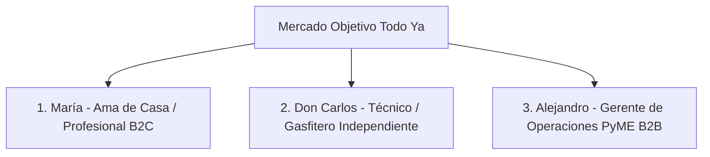

# ESTRATEGIA DE MARKETING DIGITAL, REDES SOCIALES Y CRECIMIENTO — TODO YA 📱🚀

***Guía Operativa y Plan de Acción para el Especialista / Equipo de Marketing***

*Este documento contiene las directrices estratégicas, ideas de contenido, embudos de conversión y campañas clave para posicionar a **Todo Ya** en Instagram (`@todoo__ya`), TikTok, Facebook, LinkedIn y canales locales.*

---

## 📌 1. IDENTIDAD DE MARCA Y POSICIONAMIENTO

### 1.1 Elementos de Marca y Paleta de Colores
* **Color Primario (B2C & Residencial)**: **`#FFB400`** (Amarillo/Oro Cálido). Transmite rapidez, energía y confianza.
* **Color Secundario**: **`#2F2F2F`** (Gris Oscuro Premium). Utilizado para tarjetas, tipografía y fondos elegantes.
* **Color Corporativo (B2B Empresas)**: **`#6366f1` / `#1e293b`** (Índigo Profundo). Transmite profesionalismo, formalidad y seguridad financiera.
* **Insignia de Confianza**: **`BETA`** en alto contraste para indicar constante innovación y escucha activa de los usuarios.
* **Icono Oficial**: Gráfico 3D moderno integrado en APK y versión Web.

---

### 1.2 Tono de Voz y Estilo de Comunicación
* **Cercano y Empático**: Entiende la urgencia de una emergencia del hogar (fuga de agua, apagón eléctrico).
* **Inclusivo y Multicultural**: Orgulloso de nuestras raíces andinas y amazónicas. Incorporar frases o saludos en **Quechua (`QU`)**, **Aymara (`AY`)** y **Guaraní (`GN`)**.
* **Directo y Cero Burocracia**: Promover la velocidad ("Solución en 90 segundos", "Cotización en 30 segundos").

---

## 🎯 2. BUYER PERSONAS Y SEGMENTOS OBJETIVO



1. **María (32 años) - Cliente Residencial (B2C)**:
   - *Dolor*: Emergencia en casa (fuga de agua a las 10 PM), miedo a contratar a un desconocido poco confiable.
   - *Ganancia*: Conectar con un técnico verificado por KYC en 90s cerca de su casa.
2. **Don Carlos (48 años) - Técnico Independiente (Proveedor)**:
   - *Dolor*: Depende del "boca a boca", temporadas bajas sin ingresos, no sabe usar redes sociales complicadas.
   - *Ganancia*: Recibir solicitudes directas en su celular en su idioma (Quechua/Español), sin comisiones abusivas.
3. **Alejandro (40 años) - Gerente de Operaciones (PyME B2B)**:
   - *Dolor*: Pierde 15 horas al mes llamando a proveedores para mantenimiento de oficinas y necesita Facturas SUNAT (RUC 20).
   - *Ganancia*: Subasta invertida en 30s con **3 Meses Gratis** y facturación electrónica.

---

## 📱 3. ESTRATEGIA EN REDES SOCIALES Y CONTENIDO VIRAL

### 🎵 A. Estrategia en TikTok (Formato Corto & Virilidad)
TikTok es nuestro canal de mayor alcance orgánico para generar conciencia de marca (*Awareness*).

#### Pilares de Contenido en TikTok:
1. **Humor & Situaciones Cotidianas de Emergencia (POV)**:
   - *Ejemplo*: *"POV: Se rompe el caño de la cocina a las 11 PM y tu esposo dice 'yo lo arreglo'".* ➡️ Muestra la app **Todo Ya** conectando en 90s con un plomero experto.
   - *Hook de los primeros 3s*: *"No llames al vecino pirata, mira esto..."*
2. **Retos y Demostraciones del Radar**:
   - Video en formato pantalla dividida: Un cronómetro en vivo contando 90 segundos mientras se busca un electricista en la app cerca de la ubicación actual.
3. **Historias Reales de Técnicos (Storytelling Inclusivo)**:
   - Entrevistas cortas a plomeros y carpinteros locales: *"¿Cómo Don Carlos pasó de esperar clientes en la esquina a recibir 5 pedidos diarios con Todo Ya en Quechua?"*

---

### 📸 B. Estrategia en Instagram (`@todoo__ya`)
Instagram es la vitrina estética de confianza y soporte al cliente.

#### Formatos en Instagram:
* **Reels (3 a 5 por semana)**: Videos dinámicos mostrando el uso de la **IA Gemini** ("Pide tu servicio hablando por micrófono en 10 segundos").
* **Historias Diarias**: 
  - Encuestas: *"¿Qué emergencia tuviste esta semana? 💧 Fuga de agua / ⚡ Apagón"*.
  - Capturas de reseñas de 5 estrellas de usuarios reales.
* **Carruseles de Valor (1 a 2 por semana)**:
  - *"5 Señales de que tu sistema eléctrico necesita revisión urgente"*.
  - *"Cómo solicitar 3 meses gratis de mantenimiento para tu oficina o restaurante"*.
* **Historias Destacadas (Highlights)**:
  - 🛡️ `KYC Seguro` | 🇵🇪 `RENIEC/SUNAT` | 🗣️ `Quechua/Aymara` | 💼 `Planes B2B` | 💬 `Chat Real`.

---

### 📘 C. Estrategia en Facebook & Grupos Locales
* **Publicaciones en Grupos Vecinales**: Postear en grupos de distritos (ej: *"Vecinos de Miraflores / Arequipa / Santa Cruz"*):
  - *"¿Buscas plomero o electricista confiable en el distrito? Ya no dependas de recomendaciones a ciegas, descarga Todo Ya y cotiza en vivo."*
* **Meta Ads (Publicidad Pagada)**:
  - Anuncios geolocalizados en un radio de 5 a 10 km con llamadas a la acción (*Call to Action*): *"Descarga la app y recibe S/. 15 de saldo inicial en tu Billetera Virtual"*.

---

### 💼 D. Estrategia en LinkedIn (B2B Corporativo)
* **Público Objetivo**: Administradores de empresas, jefes de logística, dueños de restaurantes y hoteles.
* **Propuesta de Valor**: *"Ahorra hasta el 40% en mantenimiento corporativo y compras de oficina con la Subasta Invertida en Tiempo Real de Todo Ya B2B."*
* **Oferta Gancho**: **3 Meses de Prueba Gratuita Ilimitada** para empresas.

---

## ⚡ 4. EMBUDO DE CONVERSIÓN Y CAMPAÑAS CLAVE

```mermaid
graph LR
    TOFU[<b>TOFU (Alcance)</b><br/>TikTok Virales & Reels<br/>Ads Geolocalizados] --> MOFU[<b>MOFU (Consideración)</b><br/>Demo de IA Gemini por Voz<br/>Verificación KYC & Facturas]
    MOFU --> BOFU[<b>BOFU (Conversión)</b><br/>Bono Monedas Billetera<br/>3 Meses Gratis B2B]
```

### Campaña 1: "Emergencia Resuelta en 90 Segundos" (B2C)
* **Objetivo**: Descargas e instalación de la app móvil.
* **Gancho**: Demostración visual de la velocidad del radar y la seguridad del filtro de identidad KYC.

### Campaña 2: "Digitaliza tu Oficio, Gana Más" (Proveedores)
* **Objetivo**: Registro y onboarding de técnicos independientes.
* **Gancho**: **0% de comisión** en el Plan Premium y uso nativo en Quechua, Aymara y Guaraní.

### Campaña 3: "Mantenimiento PyME Sin Burocracia" (B2B)
* **Objetivo**: Registro de pequeñas y medianas empresas.
* **Gancho**: **3 Meses Gratis** de solicitudes corporativas y facturación SUNAT automatizada.

---

## 📅 5. CALENDARIO EDITORIAL SEMANAL (PLANTILLA GUÍA)

| Día | Red Social | Formato | Tema / Idea de Contenido | CTA (Llamado a la Acción) |
| :--- | :--- | :--- | :--- | :--- |
| **Lunes** | TikTok / Reels | Video Corto (POV) | Humor: "Cuando intentas arreglar la fuga de agua solo". | Descarga Todo Ya en Bio 🚀 |
| **Martes** | Instagram | Carrusel | 5 Tips de mantenimiento preventivo para tu negocio. | Guarda este post 📌 |
| **Miércoles** | LinkedIn | Artículo / Post | Cómo reducir tiempos de compras B2B en PyMEs. | Registra tu empresa gratis 💼 |
| **Jueves** | TikTok / Reels | Demo de App | Demostración de IA Gemini: Pedir servicio por nota de voz. | Pruébalo gratis hoy 🎙️ |
| **Viernes** | Facebook | Post en Grupos | Recomendación vecinal de técnicos verificados en la zona. | Cotiza en tu zona 📍 |
| **Sábado** | Instagram Story | Interactivo | Encuesta de emergencias del fin de semana + Reseñas reales. | Deja tu comentario 💬 |

---

## 📊 6. MÉTRICAS CLAVE Y KPIS DE RENDIMIENTO

El equipo de marketing evaluará semanalmente las siguientes métricas:

1. **Costo de Adquisición de Cliente (CAC)**: Monto invertido en Ads / Nuevos usuarios registrados.
2. **Tasa de Conversión (Install to Order)**: % de usuarios que instalan la app y publican su primer pedido.
3. **Engagement Rate en Redes**: Comentarios, compartidos y clics en el enlace de la bio (`@todoo__ya`).
4. **Retención de Proveedores**: % de técnicos que renuevan sus planes de suscripción o recargan monedas en la billetera virtual.

---

> [!TIP]
> **Recuerda**: Todo contenido debe resaltar la combinación de **Velocidad (90s)**, **Seguridad (KYC)**, **Inclusión (Quechua/Aymara)** e **Inteligencia Artificial (Gemini)**. ¡A viralizar Todo Ya! 🚀
