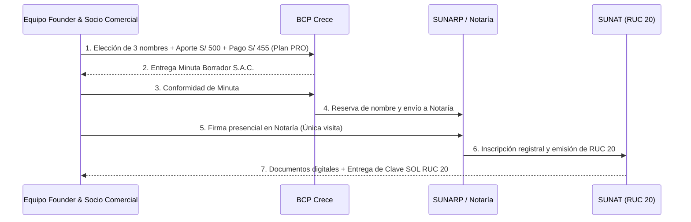
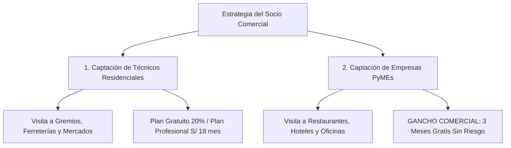

# PLAN DE ARRANQUE INMEDIATO Y PRESUPUESTO COMERCIAL — TODO YA 🚀

***Especial para el Socio Inversionista-Colaborador Comercial***

*Este documento especifica el capital exacto necesario hoy, el cronograma de tramitación legal (BCP Crece), la activación de la pasarela de pagos (Culqi) y la estrategia comercial de ventas para el lanzamiento en Perú y Bolivia.*

---

## 📌 1. RESUMEN DE CAPITAL INICIAL NECESARIO (CAPITAL ASK)

Para formalizar la empresa como **Sociedad Anónima Cerrada (S.A.C.)**, obtener el **RUC 20**, activar la pasarela de pago **Culqi** y lanzar la primera campaña comercial de captación de clientes y proveedores, se requiere la siguiente inversión inicial:

| Concepto / Rubro | Monto en Soles (S/.) | Monto aprox. (USD) | Destino / Detalle |
| :--- | :---: | :---: | :--- |
| **1. Trámite BCP Crece PRO** | **S/ 455** | ~$123 USD | Reserva de nombre en SUNARP, elaboración de minuta S.A.C., honorarios notariales, derechos registrales y obtención de **RUC 20** en SUNAT. |
| **2. Depósito de Capital Social (BCP)** | **S/ 500** | ~$135 USD | **No es un gasto**. Es el aporte mínimo de capital requerido para abrir la cuenta corriente empresarial BCP. Permanece como dinero de la empresa. |
| **3. Dominio Web (.com / .pe)** | **S/ 50** | ~$14 USD | Registro del dominio comercial oficial por 1 año. |
| **4. Licencia Google Play Console** | **S/ 95** | ~$25 USD | Pago único obligatorio para publicar la app en Google Play Store. |
| **5. Activación de Culqi API** | **S/ 0** | $0 USD | Registro e integración gratuitos. Solo se cobra comisión por transacción realizada. |
| **SUBTOTAL FORMALIZACIÓN E INFRAESTRUCTURA** | **S/ 1,100** | **~$297 USD** | **Mínimo técnico y legal obligatorio para arrancar.** |
| **6. Capital de Trabajo & Marketing Comercial (Ventas)** | **S/ 1,900 - S/ 3,900** | ~$500 - $1,050 USD | Material publicitario impreso/digital, anuncios en Facebook/TikTok Ads y fondo operativo para el socio de ventas. |
| **TOTAL INVERSIÓN INICIAL RECOMENDADA** | **S/ 3,000 - S/ 5,000** | **~$800 - $1,350 USD** | **Capital total para arrancar formalizados y vendiendo.** |

---

## 🏛️ 2. PROCESO PASO A PASO: FORMALIZACIÓN CON BCP CRECE (20 DÍAS HÁBILES)



### Requisitos necesarios que debe tener el equipo hoy:
1. **3 Opciones de Nombre** para la empresa (ej: *Todo Ya Servicios Digitales S.A.C.*, *Todo Ya LatAm S.A.C.*, etc.).
2. **DNI o Carnet de Extranjería (CE)** vigente de todos los socios fundadores.
3. **Distribución del Capital Accionario**: Definir el porcentaje de acciones que tendrá cada socio (ej: Fundadores + Socio Comercial Inversionista).
4. **Designación del Gerente General** (Representante legal ante SUNAT y bancos).

---

## 💳 3. PASOS PARA LA ACTIVACIÓN DE LA PASARELA DE PAGO CULQI

Una vez que BCP Crece entregue el **RUC 20** y la **Cuenta Corriente BCP Empresarial**, la activación de Culqi toma entre **1 y 3 días hábiles**:

```mermaid
graph LR
    RUC[1. RUC 20 Activo + Cuenta BCP] --> Panel[2. Registro en CulqiPanel]
    Panel --> Doc[3. Subir Ficha RUC + DNI Gerente]
    Doc --> Sandbox[4. Pruebas Técnicas Sandbox (0 Costo)]
    Sandbox --> Keys[5. Entrega de LLaves de Producción]
    Keys --> Pay[6. Procesamiento de Tarjetas / Yape / QR]
```

### Estructura de Comisiones Culqi (Sin costos fijos mensuales):
* **Tarjetas de Crédito / Débito**: ~3.79% + S/ 1.00 (+ IGV) por transacción efectuada.
* **Yape / Billeteras Digitales**: Tarifas preferenciales reducidas por transacción.
* **Cero costo fijo**: Si no hay ventas un mes, **Culqi cobra S/ 0**.

---

## 🚀 4. ESTRATEGIA COMERCIAL PARA EL SOCIO DE VENTAS

El socio especialista en ventas cuenta con dos motores comerciales masivos integrados en la plataforma:



### A. Estrategia de Venta B2B (Empresas PyMEs): "El Gancho Irresistible"
* **Oferta Comercial**: **3 meses completos de solicitudes e insumos ilimitados GRATIS**.
* **Argumento de Venta**: La empresa no asume ningún riesgo ni costo inicial. Durante 90 días comprueba cómo ahorra tiempo y dinero cotizando reparaciones de oficina e insumos con contraofertas en vivo.
* **Conversión a Pago**: Al día 91, la PyME ya adaptó su proceso de compras a Todo Ya y migra automáticamente al plan mensual de **S/ 72/mes (USD 20)** o corporativo personalizado.

### B. Estrategia de Venta B2C (Técnicos de Oficios):
* **Oferta Comercial**: Registro totalmente **GRATIS** con perfil verificado.
* **Argumento de Venta**: Demostración de ROI. "Si realizas 1 solo trabajo extra al mes con Todo Ya, recuperas el costo de la suscripción Profesional (**S/ 18/mes**) y el resto es ganancia neta para ti (con comisión reducida al 10% o 0%)".

---

## 📈 5. PROYECCIÓN DE RETORNO Y VENTAS EN EL PRIMER TRIMESTRE

Con un presupuesto de marketing y ventas de **S/ 1,900**:

```mermaid
bar
    title Proyección de Ingresos Recurrentes Mensuales (MRR en Soles)
    x-axis "Mes 1", "Mes 2", "Mes 3", "Mes 6"
    y-axis "Ingreso Mensual (S/.)" 0 --> 8000
    bar [450, 1400, 3200, 7800]
```

| Hito Comercial | Meta de Ventas (Técnicos) | Meta de Ventas (PyMEs) | Ingreso Mensual Proyectado (MRR) | Estado del Negocio |
| :--- | :---: | :---: | :---: | :--- |
| **Mes 1** | 25 suscritos (S/ 18/mes) | 10 PyMEs (3 meses gratis) | **S/ 450** | Cobertura total de infraestructura tecnológica. |
| **Mes 2** | 60 suscritos | 25 PyMEs | **S/ 1,400** | Retorno inicial del capital invertido en ventas. |
| **Mes 3** | 120 suscritos | 50 PyMEs (Empiezan a pagar S/ 72) | **S/ 3,200** | Flujo de caja positivo recurrente. |
| **Mes 6** | 300 suscritos | 120 PyMEs | **S/ 7,800** | Capital disponible para aceleración y expansión. |

---

## 🎯 RESUMEN EJECUTIVO PARA EL INVERSIONISTA DE VENTAS

1. **Inversión Mínima Legal + Infraestructura**: **S/ 1,100 PEN** ($297 USD).
2. **Inversión Recomendada (Formalización + Ventas + Anuncios)**: **S/ 3,000 - S/ 5,000 PEN** ($800 - $1,350 USD).
3. **Tiempo de Ejecución**: 20 días hábiles para formalización S.A.C. RUC 20 en BCP Crece y 3 días para activación de Culqi.
4. **Punto de Equilibrio**: Con solo **10 profesionales pagando S/ 18/mes**, la plataforma paga el 100% de sus costos de servidores del primer año. Todo lo demás es margen operativo para el equipo comercial y fundador.

---
*Documento operativo elaborado para el equipo comercial e inversionista de Todo Ya.*
